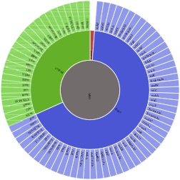

.. image:: https://travis-ci.org/arpcard/rgi.svg?branch=master
    :target: https://travis-ci.org/arpcard/rgi

The Resistance Gene Identifier (RGI) 
--------------------------------------------

This application is used to predict resistome(s) from protein or nucleotide data based on homology and SNP models. The application uses reference data from the `Comprehensive Antibiotic Resistance Database (CARD) <https://card.mcmaster.ca/>`_.

RGI analyses can be performed via the CARD website `RGI portal <https://card.mcmaster.ca/analyze/rgi>`_, via use of a `Galaxy wrapper <https://github.com/arpcard/rgi_wrapper>`_ for the `Galaxy <https://galaxyproject.org/tutorials/g101>`_ platform, or alternatively you can `Install RGI from Conda`_ or `Run RGI from Docker`_. The instructions below discuss use of RGI at the command line, following a general overview of how RGI works for genomes, genome assemblies, proteomes, and metagenomic sequencing.

**CARD reference sequences and significance cut-offs are under constant curation - as CARD curation evolves, the results of RGI evolve.**

Analyzing Genomes, Genome Assemblies, Metagenomic Contigs, or Proteomes
-----------------------------------------------------------------------

If DNA sequences are submitted, RGI first predicts complete open reading frames (ORFs) using `Prodigal <https://github.com/hyattpd/Prodigal>`_ (ignoring those less than 30 bp) and analyzes the predicted protein sequences. Short contigs, small plasmids, low quality assemblies, or merged metagenomic reads should be analyzed using Prodigal's algorithms for low quality/coverage assemblies (i.e. contigs <20,000 bp) and inclusion of partial gene prediction. If the low sequence quality option is selected, RGI uses Prodigal anonymous mode for open reading frame prediction, supporting calls of partial AMR genes from short or low quality contigs.

If protein sequences are submitted, RGI skips ORF prediction and uses the protein sequences directly.

The RGI currently supports CARD's `protein homolog models <https://card.mcmaster.ca/ontology/40292>`_ (use of BLASTP or `DIAMOND <https://ab.inf.uni-tuebingen.de/software/diamond>`_ bitscore cut-offs to detect functional homologs of AMR genes), `protein variant models <https://card.mcmaster.ca/ontology/40293>`_ (for accurate differentiation between susceptible intrinsic genes and intrinsic genes that have acquired mutations conferring AMR, based on CARD's curated SNP matrices), `rRNA mutation models <https://card.mcmaster.ca/ontology/40295>`_ (for detection of drug resistant rRNA target sequences), and `protein over-expression models <https://card.mcmaster.ca/ontology/41091>`_ (which detect efflux subunits associated AMR, but also highlights mutations conferring over-expression when present).

+----------------------------------------------------------+---------------------------------------------------+
|    Example                                               | AMR Gene                                          |
+==========================================================+===================================================+
|    Protein Homolog Model                                 | `NDM-1 <https://card.mcmaster.ca/ontology/36728>`_| 
+----------------------------------------------------------+---------------------------------------------------+
|    Protein Variant Model                                 | `Acinetobacter baumannii gyrA conferring          |
|                                                          | resistance to fluoroquinolones                    |
|                                                          | <https://card.mcmaster.ca/ontology/40507>`_       |
+----------------------------------------------------------+---------------------------------------------------+
|    rRNA Mutation Model                                   | `Campylobacter jejuni 23S rRNA with mutation      |
|                                                          | conferring resistance to erythromycin             |
|                                                          | <https://card.mcmaster.ca/ontology/42445>`_       |
+----------------------------------------------------------+---------------------------------------------------+
|    Protein Over-Expression Model                         | `MexR <https://card.mcmaster.ca/ontology/36645>`_ | 
+----------------------------------------------------------+---------------------------------------------------+

The RGI analyzes genome or proteome sequences under three paradigms: **Perfect**, **Strict**, and **Loose** (a.k.a. Discovery). The Perfect algorithm is most often applied to clinical surveillance as it detects perfect matches to the curated reference sequences and mutations in the CARD. In contrast, the Strict algorithm detects previously unknown variants of known AMR genes, including secondary screen for key mutations, using detection models with CARD's curated similarity cut-offs to ensure the detected variant is likely a functional AMR gene. The Loose algorithm works outside of the detection model cut-offs to provide detection of new, emergent threats and more distant homologs of AMR genes, but will also catalog homologous sequences and spurious partial hits that may not have a role in AMR. Combined with phenotypic screening, the Loose algorithm allows researchers to hone in on new AMR genes.

**Note: All Loose hits of 95% identity or better are automatically listed as Strict.**

All results are organized via the `Antibiotic Resistance Ontology <https://card.mcmaster.ca/ontology/36006>`_ classification: AMR Gene Family, Drug Class, and Resistance Mechanism. JSON files created at the command line can be `Uploaded at the CARD Website <https://card.mcmaster.ca/analyze/rgi>`_ for visualization.

`Example visualization of Escherichia coli EC160090 (GenBank MCNL01) <https://card.mcmaster.ca/rgi/results/MCNL01>`_

Note on metagenomic assemblies or merged metagenomic reads: this is a computationally expensive approach, since each merged read or contig set may contain partial ORFs, requiring RGI to perform large amounts of BLAST/DIAMOND analyses against CARD reference proteins. While not generally recommended, this does allow analysis of metagenomic sequences in protein space, overcoming issues of high-stringency read mapping relative to nucleotide reference databases (see below). 

Analyzing Metagenomic Reads (beta-testing)
--------------------------------------------

RGI can align short DNA sequences in FASTQ format using `Bowtie2 <http://bowtie-bio.sourceforge.net/bowtie2/index.shtml>`_ or `BWA <http://bio-bwa.sourceforge.net>`_ against CARD's `protein homolog models <https://card.mcmaster.ca/ontology/40292>`_ (support for SNP screening models will be added to future versions). FASTQ sequences can be aligned to the 'canonical' curated CARD reference sequences (i.e. sequences available in GenBank with clear experimental evidence of elevated MIC in a peer-reviewed journal available in PubMED) or additionally to the *in silico* predicted allelic variants available in CARD's `Resistomes & Variants <https://card.mcmaster.ca/genomes>`_ data set. The latter is highly recommended as the allelic diversity for AMR genes is greatly unrepresented in the published literature, hampering high-stringency read mapping (i.e. AMR genes are often only characterized for a single pathogen). Inclusion of CARD's `Resistomes & Variants <https://card.mcmaster.ca/genomes>`_ allows read mapping to predicted allelic variants and AMR gene homologs for a wide variety of pathgoens, incorporation of CARD's `Prevalence Data <https://card.mcmaster.ca/prevalence>`_ for easier interpretation of predicted AMR genes, and ultimately use of k-mer classifiers for prediction of pathogen-of-origin for FASTQ reads predicted to encode AMR genes (see below).

CARD's `Resistomes & Variants <https://card.mcmaster.ca/genomes>`_ and `Prevalence Data <https://card.mcmaster.ca/prevalence>`_ (nicknamed WildCARD) were generated using the RGI to analyze molecular sequence data available in `NCBI Genomes <https://www.ncbi.nlm.nih.gov/genome/>`_ for pathogens of interest (see `Sampling Table <https://card.mcmaster.ca/prevalence>`_). For each of these pathogens, complete chromosome sequences, complete plasmid sequences, and whole genome shotgun (WGS) assemblies were analyzed individually by RGI. RGI results were then aggregated to calculate prevalence statistics for distribution of AMR genes among pathogens and plasmids, predicted resistomes, and to produce a catalog of predicted AMR alleles. These data were predicted under RGI's **Perfect** and **Strict** paradigms (see above), the former tracking perfect matches at the amino acid level to the curated reference sequences and mutations in the CARD, while the latter predicts previously unknown variants of known AMR genes, including secondary screen for key mutations. The reported results are entirely dependant upon the curated AMR detection models in CARD, the algorithms available in RGI, the pathogens sampled, and the sequence data available at NCBI at their time of generation.

K-mer Prediction of Pathogen-of-Origin for AMR Genes (beta-testing)
--------------------------------------------------------------------------

CARD's `Resistomes & Variants <https://card.mcmaster.ca/genomes>`_ and `Prevalence Data <https://card.mcmaster.ca/prevalence>`_ (see above) provide a data set of AMR alleles and their distribution among pathogens and plasmids. CARD's k-mer classifiers sub-sample these sequences to identify k-mers (default length 61 bp) that are uniquely found within AMR alleles of individual pathogen species, pathogen genera, pathogen-restricted plasmids, or promiscuous plasmids. CARD's k-mer classifiers can then be used to predict pathogen-of-origin for hits found by RGI for genomes, genome assemblies, metagenomic contigs, or metagenomic reads.

**CARD's k-mer classifiers assume the data submitted for analysis has been predicted to encode AMR genes, via RGI or another AMR bioinformatic tool. The k-mer data set was generated from and is intended exclusively for AMR sequence space.** As above, the reported results are entirely dependant upon the curated AMR detection models in CARD, the algorithms available in RGI, and the pathogens & sequences sampled during generation of CARD's `Resistomes & Variants <https://card.mcmaster.ca/genomes>`_ and `Prevalence Data <https://card.mcmaster.ca/prevalence>`_.

Table of Contents
-------------------------------------

- `License`_
- `Citation`_
- `Support & Bug Reports`_
- `Requirements`_
- `Install Dependencies`_
- `Install RGI from Project Root`_
- `Running RGI Tests`_
- `Help Menu and Usage`_
- `Help Menus for Subcommands`_
- `Load card.json`_
- `Check Database Version`_
- `Clean Previous or Old Databases`_
- `RGI main Usage for Genomes, Genome Assemblies, Metagenomic Contigs, or Proteomes`_
- `Running RGI main with Genome or Assembly DNA Sequences`_
- `Running RGI main with Protein Sequences`_
- `Running RGI main using GNU Parallel`_
- `RGI main Tab-Delimited Output`_
- `Generating Heat Maps of RGI main Results`_
- `RGI bwt Usage for Metagenomic Reads`_
- `Load RGI bwt Reference Data`_
- `Running RGI bwt with FASTQ files`_
- `RGI bwt Tab-Delimited Output`_
- `RGI kmer_build Usage to Build K-mer Classifiers`_
- `RGI kmer_query Usage to Use K-mer Classifiers`_
- `CARD k-mer Classifier Output for RGI main results`_
- `CARD k-mer Classifier Output for RGI bwt results`_
- `Run RGI from Docker`_
- `Install RGI from Conda`_

License
--------

Use or reproduction of these materials, in whole or in part, by any non-academic organization whether or not for non-commercial (including research) or commercial purposes is prohibited, except with written permission of McMaster University. Commercial uses are offered only pursuant to a written license and user fee. To obtain permission and begin the licensing process, see the `CARD website <https://card.mcmaster.ca/about>`_.

Citation
--------

Jia et al. 2017. CARD 2017: expansion and model-centric curation of the Comprehensive Antibiotic Resistance Database. Nucleic Acids Research, 45, D566-573. [`PMID 27789705 <https://www.ncbi.nlm.nih.gov/pubmed/27789705>`_]

Support & Bug Reports
----------------------

Please log an issue on `github issue <https://github.com/arpcard/rgi/issues>`_.

You can email the CARD curators or developers directly at `card@mcmaster.ca <mailto:card@mcmaster.ca>`_, via Twitter at `@arpcard <http://www.twitter.com/arpcard>`_.

Requirements
--------------------

- `Python 3.6 <https://www.python.org/>`_
- `NCBI BLAST 2.6.0 <https://blast.ncbi.nlm.nih.gov/Blast.cgi>`_
- `six 1.7.0+ <https://bitbucket.org/gutworth/six>`_
- `zlib <https://bitbucket.org/gutworth/six>`_
- `Prodigal 2.6.3 <https://github.com/hyattpd/prodigal/wiki/Installation>`_
- `DIAMOND 0.8.36 <https://ab.inf.uni-tuebingen.de/software/diamond>`_
- `Biopython 1.60+ <https://biopython.org/>`_
- `filetype 1.0.0+ <https://pypi.org/project/filetype/>`_
- `pytest 3.0.0+ <https://docs.pytest.org/en/latest/>`_
- `mock 2.0.0 <https://pypi.org/project/mock/>`_
- `pandas 0.15.0+ <https://pandas.pydata.org/>`_
- `Matplotlib 2.1.2+ <https://matplotlib.org/>`_
- `seaborn 0.8.1+ <https://matplotlib.org/>`_
- `pyfaidx 0.5.4.1+ <https://pypi.org/project/pyfaidx/>`_
- `pyahocorasick 1.1.7+ <https://pypi.org/project/pyahocorasick/>`_
- `OligoArrayAux 3.8 <http://unafold.rna.albany.edu/?q=DINAMelt/OligoArrayAux>`_
- `samtools 1.9 <https://github.com/samtools/samtools>`_
- `bamtools 2.5.1 <https://github.com/pezmaster31/bamtools>`_
- `bedtools 2.27.1 <https://github.com/arq5x/bedtools2>`_
- `Jellyfish 2.2.10 <https://github.com/gmarcais/Jellyfish>`_
- `Bowtie2 2.3.4.3 <http://bowtie-bio.sourceforge.net/bowtie2/index.shtml>`_
- `BWA 0.7.17 (r1188) <https://github.com/lh3/bwa>`_

Install Dependencies
--------------------

- pip3 install six
- pip3 install biopython
- pip3 install filetype
- pip3 install pytest
- pip3 install mock
- pip3 install pandas
- pip3 install matplotlib
- pip3 install seaborn
- pip3 install pyfaidx
- pip3 install pyahocorasick

Install RGI from Project Root
-----------------------------

.. code-block:: sh

   pip3 install .

or

.. code-block:: sh

   python3 setup.py build
   python3 setup.py test
   python3 setup.py install

Running RGI Tests
-------------------
.. code-block:: sh
   
   cd tests
   pytest -v -rxs

Help Menu and Usage
----------------------

The following command will bring up RGI's main help menu:

.. code-block:: sh

   rgi --help

.. code-block:: sh

      usage: rgi <command> [<args>]
                  commands are:
                  ---------------------------------------------------------------------------------------
                  Database
                  ---------------------------------------------------------------------------------------

                  load     Loads CARD database, annotations and k-mer database
                  clean    Removes BLAST databases and temporary files
                  database Information on installed card database
                  galaxy   Galaxy project wrapper

                  ---------------------------------------------------------------------------------------
                  Genomic
                  ---------------------------------------------------------------------------------------

                  main     Runs rgi application
                  tab      Creates a Tab-delimited from rgi results
                  parser   Creates categorical JSON files RGI wheel visualization
                  heatmap  Heatmap for multiple analysis

                  ---------------------------------------------------------------------------------------
                  Metagenomic
                  ---------------------------------------------------------------------------------------
                  bwt                   Align reads to CARD and in silico predicted allelic variants
                  
                  ---------------------------------------------------------------------------------------
                  Baits validation
                  ---------------------------------------------------------------------------------------
                  tm                    Baits Melting Temperature

                  ---------------------------------------------------------------------------------------
                  Annotations
                  ---------------------------------------------------------------------------------------
                  card_annotation       Create fasta files with annotations from card.json
                  wildcard_annotation   Create fasta files with annotations from variants
                  baits_annotation      Create fasta files with annotations from baits (Experimental)
                  remove_duplicates     Removes duplicate sequences (Experimental)

                  ---------------------------------------------------------------------------------------
                  Pathogen of origin
                  ---------------------------------------------------------------------------------------
                  
                  kmer_build            Build AMR specific k-mers database used for pathogen of origin
                  kmer_query            Query sequences against AMR k-mers database to predict pathogen of origin

   Resistance Gene Identifier - <version_number>

   positional arguments:
   command     Subcommand to run

   optional arguments:
   -h, --help  show this help message and exit

   Use the Resistance Gene Identifier to predict resistome(s) from protein or
   nucleotide data based on homology and SNP models. Check
   https://card.mcmaster.ca/download for software and data updates. Receive email
   notification of monthly CARD updates via the CARD Mailing List
   (https://mailman.mcmaster.ca/mailman/listinfo/card-l)

Help Menus for Subcommands
----------------------------

Help screens for subcommands can be accessed using the -h argument, e.g.

.. code-block:: sh

      rgi load -h

Load card.json 
-------------------

To start analyses, first acquire the latest AMR reference data from CARD at `https://card.mcmaster.ca/latest/data <https://card.mcmaster.ca/latest/data>`_. CARD data can be installed at the system level or at the local level.

Obtain CARD data:

   .. code-block:: sh
   
      wget https://card.mcmaster.ca/latest/data
      tar -xvf data ./card.json

Local or working directory:

   .. code-block:: sh
   
      rgi load --card_json /path/to/card.json --local

System wide:

   .. code-block:: sh

      rgi load --card_json /path/to/card.json

Check Database Version
-----------------------

Local or working directory:

   .. code-block:: sh
   
      rgi database --version --local

System wide :

   .. code-block:: sh

      rgi database --version
      
Clean Previous or Old Databases
--------------------------------

Local or working directory:

   .. code-block:: sh

      rgi clean --local

System wide:

   .. code-block:: sh 
   
      rgi clean      

RGI main Usage for Genomes, Genome Assemblies, Metagenomic Contigs, or Proteomes
------------------------------------------------------------------------------------------------------

.. code-block:: sh

   rgi main -h

.. code-block:: sh

          usage: rgi main [-h] -i INPUT_SEQUENCE -o OUTPUT_FILE [-t {contig,protein}]
                          [-a {DIAMOND,BLAST}] [-n THREADS] [--include_loose] [--local]
                          [--clean] [--debug] [--low_quality]
                          [-d {wgs,plasmid,chromosome,NA}] [-v] [--split_prodigal_jobs]
          
          Resistance Gene Identifier - 4.2.2 - Main
          
          optional arguments:
            -h, --help            show this help message and exit
            -i INPUT_SEQUENCE, --input_sequence INPUT_SEQUENCE
                                  input file must be in either FASTA (contig and
                                  protein) or gzip format! e.g myFile.fasta,
                                  myFasta.fasta.gz
            -o OUTPUT_FILE, --output_file OUTPUT_FILE
                                  output folder and base filename
            -t {contig,protein}, --input_type {contig,protein}
                                  specify data input type (default = contig)
            -a {DIAMOND,BLAST}, --alignment_tool {DIAMOND,BLAST}
                                  specify alignment tool (default = BLAST)
            -n THREADS, --num_threads THREADS
                                  number of threads (CPUs) to use in the BLAST search
                                  (default=32)
            --include_loose       include loose hits in addition to strict and perfect
                                  hits
            --local               use local database (default: uses database in
                                  executable directory)
            --clean               removes temporary files
            --debug               debug mode
            --low_quality         use for short contigs to predict partial genes
            -d {wgs,plasmid,chromosome,NA}, --data {wgs,plasmid,chromosome,NA}
                                  specify a data-type (default = NA)
            -v, --version         prints software version number
            --split_prodigal_jobs
                                  run multiple prodigal jobs simultaneously for contigs
                                  in a fasta file

Running RGI main with Genome or Assembly DNA Sequences
--------------------------------------------------------

Examples use local database, exclude "--local" flag to use a system wide reference database.

Generate Perfect or Strict hits for a genome assembly or genome sequence:

   .. code-block:: sh

      rgi main --input_sequence /path/to/nucleotide_input.fasta --output_file /path/to/output_file --input_type contig --local 
      
Include Loose hits:

   .. code-block:: sh

      rgi main --input_sequence /path/to/nucleotide_input.fasta --output_file /path/to/output_file --input_type contig --local --include_loose

Short or low quality contigs with partial gene prediction, including Loose hits:

   .. code-block:: sh
   
      rgi main --input_sequence /path/to/nucleotide_input.fasta --output_file /path/to/output_file --input_type contig --local --low_quality --include_loose

High-performance (e.g. 40 processors) generation of Perfect and Strict hits for high quality genome assembly contigs:

   .. code-block:: sh
   
      rgi main --input_sequence /path/to/nucleotide_input.fasta --output_file /path/to/output_file --input_type contig --local -a DIAMOND -n 40 --split_prodigal_jobs

Running RGI main with Protein Sequences
--------------------------------------------------------

Examples use local database, exclude "--local" flag to use a system wide reference database.

Generate Perfect or Strict hits for a set of protein sequences:

   .. code-block:: sh
   
      rgi main --input_sequence /path/to/protein_input.fasta --output_file /path/to/output_file --input_type protein --local 

Include Loose hits:

   .. code-block:: sh
   
      rgi main --input_sequence /path/to/protein_input.fasta --output_file /path/to/output_file --input_type protein --local --include_loose

High-performance (e.g. 40 processors) generation of Perfect and Strict hits:

   .. code-block:: sh
   
      rgi main --input_sequence /path/to/protein_input.fasta --output_file /path/to/output_file --input_type protein --local -a DIAMOND -n 40

Running RGI main using GNU Parallel
--------------------------------------------

System wide and writing log files for each input file. Note: add code below to script.sh then run with `./script.sh /path/to/input_files`.

   .. code-block:: sh

      #!/bin/bash
      DIR=`find . -mindepth 1 -type d`
      for D in $DIR; do
            NAME=$(basename $D);
            parallel --no-notice --progress -j+0 'rgi main -i {} -o {.} -n 16 -a diamond --clean --debug > {.}.log 2>&1' ::: $NAME/*.{fa,fasta};
      done

RGI main Tab-Delimited Output
-----------------------------------

+----------------------------------------------------------+------------------------------------------------+
|    Field                                                 | Contents                                       |
+==========================================================+================================================+
|    ORF_ID                                                | Open Reading Frame identifier (internal to RGI)|
+----------------------------------------------------------+------------------------------------------------+
|    Contig                                                | Source Sequence                                |
+----------------------------------------------------------+------------------------------------------------+
|    Start                                                 | Start co-ordinate of ORF                       |
+----------------------------------------------------------+------------------------------------------------+
|    Stop                                                  | End co-ordinate of ORF                         |
+----------------------------------------------------------+------------------------------------------------+
|    Orientation                                           | Strand of ORF                                  |
+----------------------------------------------------------+------------------------------------------------+
|    Cut_Off                                               | RGI Detection Paradigm (Perfect, Strict, Loose)|
+----------------------------------------------------------+------------------------------------------------+
|    Pass_Bitscore                                         | Strict detection model bitscore cut-off        |
+----------------------------------------------------------+------------------------------------------------+
|    Best_Hit_Bitscore                                     | Bitscore value of match to top hit in CARD     |
+----------------------------------------------------------+------------------------------------------------+
|    Best_Hit_ARO                                          | ARO term of top hit in CARD                    |
+----------------------------------------------------------+------------------------------------------------+
|    Best_Identities                                       | Percent identity of match to top hit in CARD   |
+----------------------------------------------------------+------------------------------------------------+
|    ARO                                                   | ARO accession of match to top hit in CARD      |
+----------------------------------------------------------+------------------------------------------------+
|    Model_type                                            | CARD detection model type                      |
+----------------------------------------------------------+------------------------------------------------+
|    SNPs_in_Best_Hit_ARO                                  | Mutations observed in the ARO term of top hit  |
|                                                          | in CARD (if applicable)                        |
+----------------------------------------------------------+------------------------------------------------+
|    Other_SNPs                                            | Mutations observed in ARO terms of other hits  |
|                                                          | indicated by model id (if applicable)          |
+----------------------------------------------------------+------------------------------------------------+
|    Drug Class                                            | ARO Categorization                             |
+----------------------------------------------------------+------------------------------------------------+
|    Resistance Mechanism                                  | ARO Categorization                             |
+----------------------------------------------------------+------------------------------------------------+
|    AMR Gene Family                                       | ARO Categorization                             |
+----------------------------------------------------------+------------------------------------------------+
|    Predicted_DNA                                         | ORF predicted nucleotide sequence              |
+----------------------------------------------------------+------------------------------------------------+
|    Predicted_Protein                                     | ORF predicted protein sequence                 |
+----------------------------------------------------------+------------------------------------------------+
|    CARD_Protein_Sequence                                 | Protein sequence of top hit in CARD            |
+----------------------------------------------------------+------------------------------------------------+
|    Percentage Length of Reference Sequence               | (length of ORF protein /                       |
|                                                          | length of CARD reference protein)              |
+----------------------------------------------------------+------------------------------------------------+
|    ID                                                    | HSP identifier (internal to RGI)               |
+----------------------------------------------------------+------------------------------------------------+
|    Model_id                                              | CARD detection model id                        |
+----------------------------------------------------------+------------------------------------------------+
|    Nudged                                                | TRUE = Hit nudged from Loose to Strict         |
+----------------------------------------------------------+------------------------------------------------+
|    Note                                                  | Reason for nudge or other notes                |
+----------------------------------------------------------+------------------------------------------------+

Generating Heat Maps of RGI main Results
------------------------------------------------

.. code-block:: sh

   rgi heatmap -h

.. code-block:: sh

         usage: rgi heatmap [-h] -i INPUT
                            [-cat {drug_class,resistance_mechanism,gene_family}] [-f]
                            [-o OUTPUT] [-clus {samples,genes,both}]
                            [-d {plain,fill,text}] [--debug]
         
         Creates a heatmap when given multiple RGI results.
         
         optional arguments:
           -h, --help            show this help message and exit
           -i INPUT, --input INPUT
                                 Directory containing the RGI .json files (REQUIRED)
           -cat {drug_class,resistance_mechanism,gene_family}, --category {drug_class,resistance_mechanism,gene_family}
                                 The option to organize resistance genes based on a
                                 category.
           -f, --frequency       Represent samples based on resistance profile.
           -o OUTPUT, --output OUTPUT
                                 Name for the output EPS and PNG files. The number of
                                 files run will automatically be appended to the end of
                                 the file name. (default=RGI_heatmap)
           -clus {samples,genes,both}, --cluster {samples,genes,both}
                                 Option to use SciPy's hiearchical clustering algorithm
                                 to cluster rows (AMR genes) or columns (samples).
           -d {plain,fill,text}, --display {plain,fill,text}
                                 Specify display options for categories
                                 (deafult=plain).
           --debug               debug mode

RGI heatmap produces EPS and PNG image files.

Generate a heat map from pre-compiled RGI main JSON files, samples and AMR genes organized alphabetically:

      .. code-block:: sh

            rgi heatmap --input /path/to/rgi_results_json_files_directory/ --output /path/to/output_file
            
Generate a heat map from pre-compiled RGI main JSON files, samples clustered by similarity of resistome and AMR genes organized by AMR gene family:            

      .. code-block:: sh

            rgi heatmap --input /path/to/rgi_results_json_files_directory/ --output /path/to/output_file -cat gene_family -clus samples

Generate a heat map from pre-compiled RGI main JSON files, samples clustered by similarity of resistome and AMR genes organized by Drug Class:            

      .. code-block:: sh

            rgi heatmap --input /path/to/rgi_results_json_files_directory/ --output /path/to/output_file -cat drug_class -clus samples

Generate a heat map from pre-compiled RGI main JSON files, samples clustered by similarity of resistome and AMR genes organized by distribution among samples:            

      .. code-block:: sh

            rgi heatmap --input /path/to/rgi_results_json_files_directory/ --output /path/to/output_file -clus both
            
Generate a heat map from pre-compiled RGI main JSON files, samples clustered by similarity of resistome (with histogram used for abundance of identical resistomes) and AMR genes organized by distribution among samples:            

      .. code-block:: sh

            rgi heatmap --input /path/to/rgi_results_json_files_directory/ --output /path/to/output_file -clus both -f

RGI bwt Usage for Metagenomic Reads
-------------------------------------

**This is an unpublished algorithm undergoing beta-testing.**

.. code-block:: sh

   rgi bwt -h

.. code-block:: sh

          usage: rgi bwt [-h] -1 READ_ONE [-2 READ_TWO] [-a {bowtie2,bwa}] [-n THREADS]
                         -o OUTPUT_FILE [--debug] [--local] [--include_wildcard]
                         [--include_baits] [--mapq MAPQ] [--mapped MAPPED]
                         [--coverage COVERAGE]
          
          Aligns metagenomic reads to CARD and wildCARD reference using bowtie or bwa
          and provide reports.
          
          optional arguments:
            -h, --help            show this help message and exit
            -1 READ_ONE, --read_one READ_ONE
                                  raw read one (qc and trimmied)
            -2 READ_TWO, --read_two READ_TWO
                                  raw read two (qc and trimmied)
            -a {bowtie2,bwa}, --aligner {bowtie2,bwa}
                                  aligner
            -n THREADS, --threads THREADS
                                  number of threads (CPUs) to use (default=32)
            -o OUTPUT_FILE, --output_file OUTPUT_FILE
                                  name of output filename(s)
            --debug               debug mode
            --local               use local database (default: uses database in
                                  executable directory)
            --include_wildcard    include wildcard
            --include_baits       include baits
            --mapq MAPQ           filter reads based on MAPQ score
            --mapped MAPPED       filter reads based on mapped reads
            --coverage COVERAGE   filter reads based on coverage of reference sequence

**Note: the mapq, mapped, and coverage filters are planned features and do not yet work (but values are reported for manual filtering). Support for AMR bait capture methods (--include_baits) is forthcoming.**

`BWA <http://bio-bwa.sourceforge.net>`_ usage within RGI bwt:

   .. code-block:: sh
   
      bwa mem -M -t {threads} {index_directory} {read_one} > {output_sam_file}
   
`Bowtie2 <http://bowtie-bio.sourceforge.net/bowtie2/index.shtml>`_ usage within RGI bwt:
 
   .. code-block:: sh
   
      bowtie2 --very-sensitive-local --threads {threads} -x {index_directory} -U {unpaired_reads} -S {output_sam_file}

Load RGI bwt Reference Data
----------------------------

To start bwt analyses, first acquire the latest AMR reference data from CARD at `https://card.mcmaster.ca/latest/data <https://card.mcmaster.ca/latest/data>`_. CARD data can be installed at the system level or at the local level.

Obtain CARD data:

   .. code-block:: sh
   
      wget https://card.mcmaster.ca/latest/data
      tar -xvf data ./card.json

Local or working directory (note that the filename *card_database_v3.0.1.fasta* depends on the version of CARD data downloaded, please adjust accordingly):

   .. code-block:: sh
   
      rgi card_annotation -i /path/to/card.json > card_annotation.log 2>&1
      rgi load --card_json /path/to/card.json --local
      rgi load -i /path/to/card.json --card_annotation card_database_v3.0.1.fasta --local

System wide (note that the filename *card_database_v3.0.1.fasta* depends on the version of CARD data downloaded, please adjust accordingly):

   .. code-block:: sh

      rgi card_annotation -i /path/to/card.json > card_annotation.log 2>&1
      rgi load --card_json /path/to/card.json
      rgi load -i /path/to/card.json --card_annotation card_database_v3.0.1.fasta

If you are going to include CARD's `Resistomes & Variants <https://card.mcmaster.ca/genomes>`_ and `Prevalence Data <https://card.mcmaster.ca/prevalence>`_ in your analysis, this data will need to be loaded as well:

Obtain WildCARD data:

   .. code-block:: sh
   
      wget -O wildcard_data.tar.bz2 https://card.mcmaster.ca/latest/variants
      mkdir -p wildcard
      tar -xvf wildcard_data.tar.bz2 -C wildcard
      
Local or working directory (note that the filename *wildcard_database_v3.0.2.fasta* depends on the version of CARD data downloaded, please adjust accordingly):

   .. code-block:: sh
   
      rgi wildcard_annotation -i wildcard --card_json /path/to/card.json -v version_number > wildcard_annotation.log 2>&1
      rgi load --wildcard_annotation wildcard_database_v3.0.2.fasta --wildcard_index /path/to/wildcard/index-for-model-sequences.txt --local

System wide (note that the filename *wildcard_database_v3.0.2.fasta* depends on the version of CARD data downloaded, please adjust accordingly):

   .. code-block:: sh
   
      rgi wildcard_annotation -i wildcard --card_json /path/to/card.json -v version_number > wildcard_annotation.log 2>&1
      rgi load --wildcard_annotation wildcard_database_v3.0.2.fasta --wildcard_index /path/to/wildcard/index-for-model-sequences.txt

Running RGI bwt with FASTQ files
--------------------------------------

Examples use local database, exclude "--local" flag to use a system wide reference database.

Align forward and reverse FASTQ reads using `Bowtie2 <http://bowtie-bio.sourceforge.net/bowtie2/index.shtml>`_ using 8 processors against 'canonical' CARD only:

   .. code-block:: sh
   
      rgi bwt --read_one /path/to/fastq/R1.fastq.gz --read_two /path/to/fastq/R2.fastq.gz --aligner bowtie2 --output_file output_prefix --threads 8 --local 

Aligned forward and reverse FASTQ reads using `Bowtie2 <http://bowtie-bio.sourceforge.net/bowtie2/index.shtml>`_ using 8 processors against 'canonical' CARD **plus** CARD's `Resistomes & Variants <https://card.mcmaster.ca/genomes>`_:

   .. code-block:: sh
   
      rgi bwt --read_one /path/to/fastq/R1.fastq.gz --read_two /path/to/fastq/R2.fastq.gz --aligner bowtie2 --output_file output_prefix --threads 8 --include_wildcard --local 

RGI bwt Tab-Delimited Output
------------------------------

**This is an unpublished algorithm undergoing beta-testing.**

RGI bwt aligns FASTQ reads to the AMR alleles used as reference sequences, with results provided for allele mapping and summarized at the AMR gene level (i.e. summing allele level results by gene). Five tab-delimited files are produced:

+----------------------------------------------------------+------------------------------------------------+
|    File                                                  | Contents                                       |
+==========================================================+================================================+
|    output_prefix.allele_mapping_data.txt                 | RGI bwt read mapping results at allele level   |
+----------------------------------------------------------+------------------------------------------------+
|    output_prefix.gene_mapping_data.txt                   | RGI bwt read mapping results at gene level     | 
+----------------------------------------------------------+------------------------------------------------+
|    output_prefix.artifacts_mapping_stats.txt             | Statistics for read mapping artifacts          |
+----------------------------------------------------------+------------------------------------------------+
|    output_prefix.overall_mapping_stats.txt               | Statistics for overall read mapping results    |
+----------------------------------------------------------+------------------------------------------------+
|    output_prefix.reference_mapping_stats.txt             | Statistics for reference matches               |
+----------------------------------------------------------+------------------------------------------------+

RGI bwt read mapping results at allele level
-----------------------------------------------

+----------------------------------------------------------+---------------------------------------------------+
|    Field                                                 | Contents                                          |
+==========================================================+===================================================+
|    Reference Sequence                                    | Reference allele to which reads have been mapped  |
+----------------------------------------------------------+---------------------------------------------------+
|    ARO Term                                              | ARO Term                                          | 
+----------------------------------------------------------+---------------------------------------------------+
|    ARO Accession                                         | ARO Accession                                     |
+----------------------------------------------------------+---------------------------------------------------+
|    Reference Model Type                                  | CARD detection model type                         |
+----------------------------------------------------------+---------------------------------------------------+
|    Reference DB                                          | Reference allele is from either CARD or WildCARD  |
+----------------------------------------------------------+---------------------------------------------------+
|    Reference Allele Source                               | See below                                         |
+----------------------------------------------------------+---------------------------------------------------+
|    Resistomes & Variants: Observed in Genome(s)          | Has this allele been observed in a CARD Prevalence|
|                                                          | genome sequence?                                  | 
+----------------------------------------------------------+---------------------------------------------------+
|    Resistomes & Variants: Observed in Plasmid(s)         | Has this allele been observed in a CARD Prevalence|
|                                                          | plasmid sequence?                                 |
+----------------------------------------------------------+---------------------------------------------------+
|    Resistomes & Variants: Observed Pathogen(s)           | CARD Prevalence pathogens bearing this allele     |
+----------------------------------------------------------+---------------------------------------------------+
|    Completely Mapped Reads                               | Number of reads mapped completely to allele       |
+----------------------------------------------------------+---------------------------------------------------+
|    Mapped Reads with Flanking Sequence                   | Number of reads mapped incompletely to allele     |
+----------------------------------------------------------+---------------------------------------------------+
|    All Mapped Reads                                      | Sum of previous two columns                       | 
+----------------------------------------------------------+---------------------------------------------------+
|    Percent Coverage                                      | Percent of reference allele covered by reads      |
+----------------------------------------------------------+---------------------------------------------------+
|    Length Coverage (bp)                                  | Base pairs of reference allele covered by reads   |
+----------------------------------------------------------+---------------------------------------------------+
|    Average MAPQ (Completely Mapped Reads)                | Average MAPQ value                                |
+----------------------------------------------------------+---------------------------------------------------+
|    Mate Pair Linkage                                     | For mate pair sequencing, if a sister read maps to|
|                                                          | a different AMR gene, this is listed              |
+----------------------------------------------------------+---------------------------------------------------+
|    Reference Length                                      | Length (bp) of reference allele                   | 
+----------------------------------------------------------+---------------------------------------------------+
|    AMR Gene Family                                       | ARO Categorization                                |
+----------------------------------------------------------+---------------------------------------------------+
|    Drug Class                                            | ARO Categorization                                |
+----------------------------------------------------------+---------------------------------------------------+
|    Resistance Mechanism                                  | ARO Categorization                                |
+----------------------------------------------------------+---------------------------------------------------+

**Reference Allele Source:**

Entries with *CARD Curation* are aligned to a reference allele from a published, characterized AMR gene, i.e. 'canonical CARD', and thus encode a 100% match to the reference protein sequence. Otherwise, entries will be reported as *in silico* allele predictions based on either **Perfect** or **Strict** RGI hits in CARD's `Resistomes & Variants <https://card.mcmaster.ca/genomes>`_, with percent identity to the CARD reference protein reported. Hits with low values should be used with caution, as CARD's `Resistomes & Variants <https://card.mcmaster.ca/genomes>`_ has predicted low identity AMR homologs.

RGI bwt read mapping results at gene level
--------------------------------------------

+----------------------------------------------------------+---------------------------------------------------+
|    Field                                                 | Contents                                          |
+==========================================================+===================================================+
|    ARO Term                                              | ARO Term                                          | 
+----------------------------------------------------------+---------------------------------------------------+
|    ARO Accession                                         | ARO Accession                                     |
+----------------------------------------------------------+---------------------------------------------------+
|    Reference Model Type                                  | CARD detection model type                         |
+----------------------------------------------------------+---------------------------------------------------+
|    Reference DB                                          | Reference allele(s) are from CARD and/or WildCARD |
+----------------------------------------------------------+---------------------------------------------------+
|    Alleles Mapped                                        | # of alleles for this AMR gene with mapped reads  |
+----------------------------------------------------------+---------------------------------------------------+
|    Reference Allele(s) Identity to CARD Reference Protein| See below                                         |
+----------------------------------------------------------+---------------------------------------------------+
|    Resistomes & Variants: Observed in Genome(s)          | Has this gene been observed in a CARD Prevalence  |
|                                                          | genome sequence?                                  | 
+----------------------------------------------------------+---------------------------------------------------+
|    Resistomes & Variants: Observed in Plasmid(s)         | Has this gene been observed in a CARD Prevalence  |
|                                                          | plasmid sequence?                                 |
+----------------------------------------------------------+---------------------------------------------------+
|    Resistomes & Variants: Observed Pathogen(s)           | CARD Prevalence pathogens bearing this gene       |
+----------------------------------------------------------+---------------------------------------------------+
|    Completely Mapped Reads                               | Number of reads mapped completely to gene         |
+----------------------------------------------------------+---------------------------------------------------+
|    Mapped Reads with Flanking Sequence                   | Number of reads mapped incompletely to gene       |
+----------------------------------------------------------+---------------------------------------------------+
|    All Mapped Reads                                      | Sum of previous two columns                       | 
+----------------------------------------------------------+---------------------------------------------------+
|    Average Percent Coverage                              | Average % of reference allele(s) covered by reads |
+----------------------------------------------------------+---------------------------------------------------+
|    Average Length Coverage (bp)                          | Average bp of reference allele(s) covered by reads|
+----------------------------------------------------------+---------------------------------------------------+
|    Average MAPQ (Completely Mapped Reads)                | Statistics for reference matches                  |
+----------------------------------------------------------+---------------------------------------------------+
|    Number of Mapped Baits                                | not yet supported                                 |
+----------------------------------------------------------+---------------------------------------------------+
|    Number of Mapped Baits with Reads                     | not yet supported                                 |
+----------------------------------------------------------+---------------------------------------------------+
|    Average Number of reads per Bait                      | not yet supported                                 |
+----------------------------------------------------------+---------------------------------------------------+
|    Number of reads per Bait Coefficient of Variation (%) | not yet supported                                 |
+----------------------------------------------------------+---------------------------------------------------+
|    Mate Pair Linkage (# reads)                           | For mate pair sequencing, if a sister read maps to|
|                                                          | a different AMR gene, this is listed (# reads     |
|                                                          | supporting linkage in parentheses)                |
+----------------------------------------------------------+---------------------------------------------------+
|    AMR Gene Family                                       | ARO Categorization                                |
+----------------------------------------------------------+---------------------------------------------------+
|    Drug Class                                            | ARO Categorization                                |
+----------------------------------------------------------+---------------------------------------------------+
|    Resistance Mechanism                                  | ARO Categorization                                |
+----------------------------------------------------------+---------------------------------------------------+

**Reference Allele(s) Identity to CARD Reference Protein:**

Gives range of *Reference Allele Source* values reported in the RGI bwt read mapping results at allele level, indicating the range of percent identity at the amino acid level of the encoded proteins to the corresponding CARD reference sequence. Hits with low values should be used with caution, as CARD's `Resistomes & Variants <https://card.mcmaster.ca/genomes>`_ has predicted low identity AMR homologs.

RGI kmer_build Usage to Build K-mer Classifiers
---------------------------------------------------------

**This is an unpublished algorithm undergoing beta-testing.**

As outlined above, CARD's `Resistomes & Variants <https://card.mcmaster.ca/genomes>`_ and `Prevalence Data <https://card.mcmaster.ca/prevalence>`_ provide a data set of AMR alleles and their distribution among pathogens and plasmids. CARD's k-mer classifiers sub-sample these sequences to identify k-mers that are uniquely found within AMR alleles of individual pathogen species, pathogen genera, pathogen-restricted plasmids, or promiscuous plasmids. Before k-mer analyses can be performed, the k-mer set(s) need to be built from CARD's `Resistomes & Variants <https://card.mcmaster.ca/genomes>`_ and `Prevalence Data <https://card.mcmaster.ca/prevalence>`_. The default k-mer length is 61 bp (based on unpublished analyses), but users can select their own k-mer length to create any number of k-mer sets.

.. code-block:: sh

   rgi kmer_build -h

.. code-block:: sh

          usage: rgi [-h] [-i INPUT_DIRECTORY] -c CARD_FASTA -k K [--skip]
          
          Builds the kmer sets for CARD*kmers
          
          optional arguments:
            -h, --help            show this help message and exit
            -i INPUT_DIRECTORY, --input_directory INPUT_DIRECTORY
                                  input directory of prevalence data
            -c CARD_FASTA, --card CARD_FASTA
                                  fasta file of CARD reference sequences. If missing,
                                  run 'rgi card_annotation' to generate.
            -k K                  k-mer size (e.g., 61)
            --skip                Skips the concatenation and splitting of the CARD*R*V
                                  sequences.

Obtain and format CARD data:

   .. code-block:: sh
   
      wget https://card.mcmaster.ca/latest/data
      tar -xvf data ./card.json
      rgi card_annotation -i /path/to/card.json > card_annotation.log 2>&1

Obtain WildCARD data:

   .. code-block:: sh
   
      wget -O wildcard_data.tar.bz2 https://card.mcmaster.ca/latest/variants
      mkdir -p wildcard
      tar -xvf wildcard_data.tar.bz2 -C wildcard

Local build and load of default (61 bp) CARD k-mer Classifiers (note that the filename *card_database_v3.0.1.fasta* depends on the version of CARD data downloaded, please adjust accordingly):

   .. code-block:: sh
   
      rgi kmer_build -i wildcard/ -c card_database_v3.0.1.fasta -k 61 > kmer_build.61.log 2>&1
      rgi load --kmer_database 61_kmer_db.json --amr_kmers all_amr_61mers.txt --kmer_size 61 --local --debug > kmer_load.61.log 2>&1

RGI kmer_query Usage to Use K-mer Classifiers
---------------------------------------------------------

**This is an unpublished algorithm undergoing beta-testing.**

Examples use local database, exclude "--local" flag to use a system wide reference database.

CARD's k-mer classifiers assume the data submitted for analysis has been predicted to encode AMR genes, via RGI or another AMR bioinformatic tool. The k-mer data set was generated from and is intended exclusively for AMR sequence space. To be considered for a taxonomic prediction, individual sequences (e.g. FASTA, RGI predicted ORF, metagenomic read) must pass the *--minimum* coverage value (default of 10, i.e. a minimum of 10 classifier k-mers must map to the sequence). Subsequent classification is based on the following logic tree:

.. image:: ./kmerlogic.jpg

.. code-block:: sh

   rgi kmer_query -h

.. code-block:: sh

          usage: rgi [-h] -i INPUT [--bwt] [--rgi] [--fasta] -k K [-m MIN] [-n THREADS]
                     -o OUTPUT [--local] [--debug]
          
          Tests sequenes using CARD*k-mers
          
          optional arguments:
            -h, --help            show this help message and exit
            -i INPUT, --input INPUT
                                  Input file (bam file from RGI*BWT, json file of RGI
                                  results, fasta file of sequences)
            --bwt                 Specify if the input file for analysis is a bam file
                                  generated from RGI*BWT
            --rgi                 Specify if the input file is a RGI results json file
            --fasta               Specify if the input file is a fasta file of sequences
            -k K, --kmer_size K   length of k
            -m MIN, --minimum MIN
                                  Minimum number of kmers in the called category for the
                                  classification to be made (default=10).
            -n THREADS, --threads THREADS
                                  number of threads (CPUs) to use (default=32)
            -o OUTPUT, --output OUTPUT
                                  Output file name.
            --local               use local database (default: uses database in
                                  executable directory)
            --debug               debug mode

CARD k-mer Classifier analysis of an individual FASTA file (e.g. using 8 processors, minimum k-mer coverage of 10):

.. code-block:: sh

   rgi kmer_query --fasta -k 61 -n 8 --minimum 10 -i /path/to/nucleotide_input.fasta -o /path/to/output_file --local

CARD k-mer Classifier analysis of Genome or Assembly DNA Sequences RGI main results (e.g. using 8 processors, minimum k-mer coverage of 10):

.. code-block:: sh

   rgi kmer_query --rgi -k 61 -n 8 --minimum 10 -i /path/to/rgi_main.json -o /path/to/output_file --local
   
CARD k-mer Classifier analysis of Metagenomics RGI btw results (e.g. using 8 processors, minimum k-mer coverage of 10):

.. code-block:: sh

   rgi kmer_query --bwt -k 61 -n 8 --minimum 10 -i /path/to/rgi_bwt.bam -o /path/to/output_file --local

CARD k-mer Classifier Output for RGI main results
--------------------------------------------------

+----------------------------------------------------------+----------------------------------------------------+
|    Field                                                 | Contents                                           |
+==========================================================+====================================================+
|    CARD kmer Prediction                                  | Taxonomic prediction, with indication if the kmers |
|                                                          | are known exclusively from chromosomes, exclusively|
|                                                          | from plasmids, or can be found in either           |
|                                                          | chromosomes or plasmids                            | 
+----------------------------------------------------------+----------------------------------------------------+
|    Taxonomic kmers                                       | Number of k-mer hits broken down by taxonomy       |
+----------------------------------------------------------+----------------------------------------------------+
|    Genomic kmers                                         | Number of k-mer hits exclusive to chromosomes,     |
|                                                          | exclusively to plasmids, or found in either        |
|                                                          | chromosomes or plasmids                            |
+----------------------------------------------------------+----------------------------------------------------+

CARD k-mer Classifier Output for RGI bwt results
--------------------------------------------------

+----------------------------------------------------------+----------------------------------------------------+
|    Field                                                 | Contents                                           |
+==========================================================+====================================================+
|    CARD kmer Prediction                                  | *Number of reads* classified for each taxon, with  |
|                                                          | indication if the kmers are known exclusively from |
|                                                          | chromosomes, exclusively from plasmids, or can be  |
|                                                          | found in either chromosomes or plasmids            |
+----------------------------------------------------------+----------------------------------------------------+

Run RGI from Docker
-------------------

First you you must either pull the Docker container from dockerhub (latest CARD version automatically installed):

  .. code-block:: sh

        docker pull finlaymaguire/rgi

Or alternatively, build it locally from the Dockerfile (latest CARD version automatically installed):

  .. code-block:: sh

        git clone https://github.com/arpcard/rgi
        docker build -t arpcard/rgi rgi

Then you can either run interactively (mounting a local directory called `rgi_data` in your current directory to `/data/` within the container:

  .. code-block:: sh

        docker run -i -v $PWD/rgi_data:/data -t arpcard/rgi bash

Or you can directly run the container as an executable with `$RGI_ARGS` being any of the commands described above. Remember paths to input and outputs files are relative to the container (i.e. `/data/` if mounted as above):

  .. code-block:: sh
        
        docker run -v $PWD/rgi_data:/data arpcard/rgi $RGI_ARGS

Install RGI from Conda
-------------------

Search for RGI package and show available versions:

  .. code-block:: sh
        
        $ conda search --channel bioconda rgi

Install RGI package:

  .. code-block:: sh
        
        $ conda install --channel bioconda rgi

Install RGI specific version:

  .. code-block:: sh
        
        $ conda install --channel bioconda rgi=3.1.1

Remove RGI package:

  .. code-block:: sh
        
        $ conda remove --channel bioconda rgi

