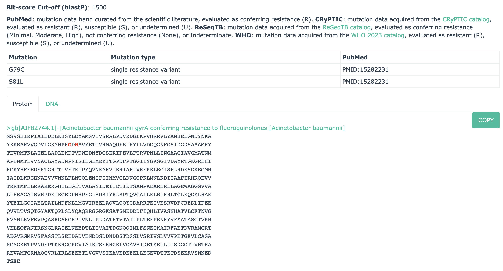

|build-status| |docs|

.. |build-status| image:: https://travis-ci.org/arpcard/rgi.svg?branch=master
    :alt: build status
    :scale: 100%
    :target: https://travis-ci.org/arpcard/rgi

.. |docs| image:: https://img.shields.io/badge/install%20with-bioconda-brightgreen.svg?style=flat
    :alt: Documentation
    :scale: 100%
    :target: http://bioconda.github.io/recipes/rgi/README.html

====================================
The Resistance Gene Identifier (RGI)
====================================

This application is used to predict antibiotic resistome(s) from protein or nucleotide data based on homology and SNP models. The application uses reference data from the `Comprehensive Antibiotic Resistance Database (CARD) <https://card.mcmaster.ca/>`_.

RGI analyses can be performed via the CARD website `RGI portal <https://card.mcmaster.ca/analyze/rgi>`_, via use of a `Galaxy wrapper <https://toolshed.g2.bx.psu.edu/view/card/rgi/715bc9aeef69>`_ for the `Galaxy <https://galaxyproject.org/tutorials/g101>`_ platform, or alternatively you can install RGI from Conda or run RGI from Docker (see below). The instructions below discuss use of RGI at the command line, following a general overview of how RGI works for genomes, genome assemblies, proteomes, and metagenomic sequencing.

**CARD reference sequences and significance cut-offs are under constant curation - as CARD curation evolves, the results of RGI evolve.**

 > `CARD Frequency Asked Questions <https://github.com/arpcard/FAQ>`_

.. contents::

Overview of RGI
===============

Analyzing Genomes, Genome Assemblies, Metagenomic Contigs, or Proteomes (a.k.a. RGI main)
-----------------------------------------------------------------------------------------

 > The text below provides an overview of analysis of FASTA sequences (contigs, genomes, etc.). For command line examples see `Running RGI main with Genome or Assembly DNA Sequences <#running-rgi-main-with-genome-or-assembly-dna-sequences>`_.

If DNA FASTA sequences are submitted, RGI first predicts complete open reading frames (ORFs) using `Prodigal <https://github.com/hyattpd/Prodigal>`_ (ignoring those less than 30 bp) and analyzes the predicted protein sequences. This includes a secondary correction by RGI if Prodigal undercalls the correct start codon to ensure complete AMR genes are predicted. However, if Prodigal fails to predict an AMR ORF, RGI will produce a false negative result.

Short contigs, small plasmids, low quality assemblies, or merged metagenomic reads should be analyzed using Prodigal's algorithms for low quality/coverage assemblies (i.e. contigs <20,000 bp) and inclusion of partial gene prediction. If the low sequence quality option is selected, RGI uses Prodigal anonymous mode for open reading frame prediction, supporting calls of partial AMR genes from short or low quality contigs.

If protein FASTA sequences are submitted, RGI skips ORF prediction and uses the protein sequences directly.

The RGI analyzes genome or proteome sequences under a **Perfect**, **Strict**, and **Loose** (a.k.a. Discovery) paradigm. The Perfect algorithm is most often applied to clinical surveillance as it detects perfect matches to the curated reference sequences in CARD. In contrast, the Strict algorithm detects previously unknown variants of known AMR genes, including secondary screen for key mutations, using detection models with CARD's curated similarity cut-offs to ensure the detected variant is likely a functional AMR gene. The Loose algorithm works outside of the detection model cut-offs to provide detection of new, emergent threats and more distant homologs of AMR genes, but will also catalog homologous sequences and spurious partial matches that may not have a role in AMR. Combined with phenotypic screening, the Loose algorithm allows researchers to hone in on new AMR genes.

Within the **Perfect**, **Strict**, and **Loose** paradigm, RGI currently supports CARD's `protein homolog models <https://card.mcmaster.ca/ontology/40292>`_, `protein variant models <https://card.mcmaster.ca/ontology/40293>`_, `protein over-expression models <https://card.mcmaster.ca/ontology/41091>`_, and `rRNA mutation models <https://card.mcmaster.ca/ontology/40295>`_:

* **Protein Homolog Models** (PHM) detect protein sequences based on their similarity to a curated reference sequence, using curated BLASTP bitscore cut-offs, for example `NDM-1 <https://card.mcmaster.ca/ontology/36728>`_. Protein Homolog Models apply to all genes that confer resistance through their presence in an organism, such as the presence of a beta-lactamase gene on a plasmid. PHMs include a reference sequence and a bitscore cut-off for detection using BLASTP. A Perfect RGI match is 100% identical to the reference protein sequence along its entire length, a Strict RGI match is not identical but the bit-score of the matched sequence is greater than the curated BLASTP bit-score cutoff, Loose RGI matches have a bit-score less than the curated BLASTP bit-score cut-off.
* **Protein Variant Models** (PVM) perform a similar search as Protein Homolog Models (PHM), i.e. detect protein sequences based on their similarity to a curated reference sequence, but secondarily screen query sequences for curated sets of mutations to differentiate them from antibiotic susceptible wild-type alleles, for example `Acinetobacter baumannii gyrA conferring resistance to fluoroquinolones <https://card.mcmaster.ca/ontology/40507>`_. PVMs are designed to detect AMR acquired via mutation of house-keeping genes or antibiotic targets. PVMs include a protein reference sequence (often from antibiotic susceptible wild-type alleles), a curated bit-score cut-off, and mapped resistance variants. Mapped resistance variants may include any or all of single point mutations, insertions, or deletions curated from the scientific literature. A Strict RGI match has a BLASTP bit-score above the curated BLASTP cutoff value and contains at least one curated mutation from amongst the mapped resistance variants, while a Loose RGI match has a bit-score less than the curated BLASTP bit-score cut-off but still contains at least one curated mutation from amongst the mapped resistance variants.
* **Protein Overexpression Models** (POM) are similar to Protein Variant Models (PVM) in that they include a protein reference sequence, a curated BLASTP bitscore cut-off, and mapped resistance variants. Whereas PVMs are designed to detect AMR acquired via mutation of house-keeping genes or antibiotic targets, reporting only those with curated mutations conferring AMR, POMs are restricted to regulatory proteins and report both wild-type sequences and/or sequences with mutations leading to overexpression of efflux complexes, for example `MexS <https://card.mcmaster.ca/ontology/37193>`_. The former lead to efflux of antibiotics at basal levels, while the latter can confer clinical resistance. POMs include a protein reference sequence (often from wild-type alleles), a curated bit-score cut-off, and mapped resistance variants. Mapped resistance variants may include any or all of single point mutations, insertions, or deletions curated from the scientific literature. A Perfect RGI match is 100% identical to the wild-type reference protein sequence along its entire length, a Strict RGI match has a BLASTP bit-score above the curated BLASTP cutoff value may or may not contain at least one curated mutation from amongst the mapped resistance variants, while a Loose RGI match has a bit-score less than the curated BLASTP bit-score cut-off may or may not contain at least one curated mutation from amongst the mapped resistance variants.
* **Ribosomal RNA (rRNA) Gene Variant Models** (RVM) are similar to Protein Variant Models (PVM), i.e. detect  sequences based on their similarity to a curated reference sequence and secondarily screen query sequences for curated sets of mutations to differentiate them from antibiotic susceptible wild-type alleles, except RVMs are designed to detect AMR acquired via mutation of genes encoding ribosomal RNAs (rRNA), for example `Campylobacter jejuni 23S rRNA with mutation conferring resistance to erythromycin <https://card.mcmaster.ca/ontology/42445>`_. RVMs include a rRNA reference sequence (often from antibiotic susceptible wild-type alleles), a curated bit-score cut-off, and mapped resistance variants. Mapped resistance variants may include any or all of single point mutations, insertions, or deletions curated from the scientific literature. A Strict RGI match has a BLASTN bit-score above the curated BLASTN cutoff value and contains at least one curated mutation from amongst the mapped resistance variants, while a Loose RGI match has a bit-score less than the curated BLASTN bit-score cut-off but still contains at least one curated mutation from amongst the mapped resistance variants.

**Example**: The `Acinetobacter baumannii gyrA conferring resistance to fluoroquinolones <https://card.mcmaster.ca/ontology/40507>`_ Protein Variant Model has a bitscore cut-off of 1500 to separate **Strict** & **Loose** hits based on their similarity to the curated antibiotic susceptible reference protein AJF82744.1, but RGI will only report an antibiotic resistant version of this gene if the query sequence has the G79C or S81L substitutions:



All RGI results are organized via the `Antibiotic Resistance Ontology <https://card.mcmaster.ca/ontology/36006>`_ classification: AMR Gene Family, Drug Class, and Resistance Mechanism. JSON files created at the command line can be `Uploaded at the CARD Website <https://card.mcmaster.ca/analyze/rgi>`_ for visualization, for example the Mycobacterium tuberculosis H37Rv complete genome (GenBank AL123456):

.. image:: images/rgiwheel.jpg

**Note**: Users have the option of using BLAST or `DIAMOND <https://github.com/bbuchfink/diamond>`_ for generation of local alignments and assessment of bitscores within RGI. The default is BLAST, but DIAMOND generates alignments faster than BLAST and the RGI developers routinely assess DIAMOND's performance to ensure it calculates equivalent bitscores as BLAST given RGI's Perfect / Strict / Loose paradigm is dependant upon hand curated bitscore cut-offs. As such, RGI may not support the latest version of DIAMOND.

 > `What are CARD detection models and how are bitscore cut-offs determined? <https://github.com/arpcard/rgi/issues/140>`_

**UPDATED RGI version 6.0.0 onward: In earlier versions of RGI, by default all Loose matches of 95% identity or better were automatically listed as Strict, regardless of alignment length. At that time, this behaviour could only be suppressed by using the --exclude_nudge parameter. This default behaviour and the --exclude_nudge parameter have been discontinued. Loose matches of 95% identity or better can now only be listed (i.e., nudged) as Strict matches, regardless of alignment length, by use of the new --include_nudge parameter. As such, these often spurious results are no longer included in default RGI main output.**

Curation at CARD is routinely ahead of RGI software development, so not all parameters or models curated in CARD will be annotated in sequences analyzed using RGI. For example, RGI does not currently support CARD's `protein knockout models <https://card.mcmaster.ca/ontology/40354>`_, `protein domain meta-models <https://card.mcmaster.ca/ontology/40326>`_, `gene cluster meta-models <https://card.mcmaster.ca/ontology/40298>`_, or `efflux pump system meta-models <https://card.mcmaster.ca/ontology/41112>`_. In addition, while CARD's `protein variant models <https://card.mcmaster.ca/ontology/40293>`_, `protein over-expression models <https://card.mcmaster.ca/ontology/41091>`_, and `rRNA mutation models <https://card.mcmaster.ca/ontology/40295>`_ are current supported by RGI, mutation screening currently only supports annotation of resistance-conferring SNPs via the `single resistance variant <https://card.mcmaster.ca/ontology/36301>`_ parameter. For example, here is a snapshot from CARD 3.2.3 for `protein variant models <https://card.mcmaster.ca/ontology/40293>`_:

+----------------------------------------------------------+------------------------------------------------+---------------------+
|    Parameters Among 220 PVMs                             | Frequency                                      | Supported by RGI    |
+==========================================================+================================================+=====================+
|    single resistance variant                             | 1299                                           |yes                  |
+----------------------------------------------------------+------------------------------------------------+---------------------+
|    high confidence TB                                    | 227                                            |no                   |
+----------------------------------------------------------+------------------------------------------------+---------------------+
|    multiple resistance variants                          | 113                                            |no                   |
+----------------------------------------------------------+------------------------------------------------+---------------------+
|    deletion mutation from nucleotide sequence            | 95                                             |no                   |
+----------------------------------------------------------+------------------------------------------------+---------------------+
|    insertion mutation from nucleotide sequence           | 65                                             |no                   |
+----------------------------------------------------------+------------------------------------------------+---------------------+
|    nonsense mutation                                     | 52                                             |no                   |
+----------------------------------------------------------+------------------------------------------------+---------------------+
|    minimal confidence TB                                 | 43                                             |no                   |
+----------------------------------------------------------+------------------------------------------------+---------------------+
|    co-dependent single resistance variant                | 39                                             |no                   |
+----------------------------------------------------------+------------------------------------------------+---------------------+
|    moderate confidence TB                                | 28                                             |no                   |
+----------------------------------------------------------+------------------------------------------------+---------------------+
|    deletion mutation from peptide sequence               | 22                                             |no                   |
+----------------------------------------------------------+------------------------------------------------+---------------------+
|    frameshift mutation                                   | 14                                             |no                   |
+----------------------------------------------------------+------------------------------------------------+---------------------+
|    insertion mutation from peptide sequence              | 9                                              |no                   |
+----------------------------------------------------------+------------------------------------------------+---------------------+
|    co-dependent insertion/deletion                       | 8                                              |no                   |
+----------------------------------------------------------+------------------------------------------------+---------------------+
|    co-dependent nonsense SNP                             | 5                                              |no                   |
+----------------------------------------------------------+------------------------------------------------+---------------------+
|    snp in promoter region                                | 4                                              |no                   |
+----------------------------------------------------------+------------------------------------------------+---------------------+
|    disruptive mutation in regulatory element             | 2                                              |no                   |
+----------------------------------------------------------+------------------------------------------------+---------------------+

Lastly, analyzing metagenomic assemblies or merged metagenomic reads using RGI main is a computationally intensive approach, since each merged read or contig FASTA set may contain partial ORFs, requiring RGI to perform large amounts of BLAST/DIAMOND analyses against CARD reference proteins. However, this approach does (1) allow analysis of metagenomic sequences in protein space, overcoming issues of high-stringency read mapping relative to nucleotide reference databases (see below), and (2) allow inclusion of `protein variant models <https://card.mcmaster.ca/ontology/40293>`_, `rRNA mutation models <https://card.mcmaster.ca/ontology/40295>`_, and `protein over-expression models <https://card.mcmaster.ca/ontology/41091>`_ when annotating the resistome (as outlined below, RGI bwt's read mapping algorithms do not support models that require screening for mutations).

 > `What RGI settings are best for a Metagenome-Assembled Genome (MAG)? <https://github.com/arpcard/FAQ#rgi-faqs>`_

Analyzing Metagenomic Reads (a.k.a. RGI bwt)
--------------------------------------------

 >  The text below provides an overview of analysis of FASTQ sequencing reads. For command line examples see `Running RGI bwt with FASTQ files <#running-rgi-bwt-with-fastq-files>`_.

RGI can align short DNA sequences in FASTQ format using `Bowtie2 <http://bowtie-bio.sourceforge.net/bowtie2/index.shtml>`_ , `BWA <http://bio-bwa.sourceforge.net>`_ , or `KMA <https://bitbucket.org/genomicepidemiology/kma/src/master>`_ against CARD's `protein homolog models <https://card.mcmaster.ca/ontology/40292>`_. The default and recommended read aligner is `KMA <https://bitbucket.org/genomicepidemiology/kma/src/master>`_ due to its documented `better performance for redundant databases <https://pubmed.ncbi.nlm.nih.gov/30157759/>`_ such as CARD. While CARD is not truly redundant, i.e. there are no identical reference sequences, CARD does reflect the `AMR alelle network problem <https://pubmed.ncbi.nlm.nih.gov/29335005/>`_ in that many sequences are very similar. For example, the nucleotide sequences of TEM-1 and TEM-2 are `99% similar with no alignment gaps <images/TEM-alignment.jpg>`_. A sample generating short reads from a legitimate TEM-1 gene may result in reads aligned among TEM-1, TEM-2, or other TEM beta-lactamases depending upon the alignment algorithm chosen. The `KMA publication <https://pubmed.ncbi.nlm.nih.gov/30157759/>`_ and our own simulations find KMA best resolves this issue:

.. image:: images/simulation.jpg
The above illustrates simulated 90x short read coverage from seven antibiotic resistance gene nucleotide reference sequences in CARD (catB, OXA-1, AAC(6')-Ib, NDM-1, BRP(MBL), QnrB1, CTX-M-15), subsequently aligned with RGI bwt against CARD using Bowtie2 or KMA algorithms. Reads are aligned to a single reference gene using KMA but for Bowtie2 the same reads are aligned across a selection of similar reference sequences, with associated lower MAPQ scores. Note that KMA has limits in its ability to resolve very similar sequences, e.g. all simulated catB3 reads were all aligned to catI and all simulated AAC(6')-Ib reads were aligned to AAC(6')-Ib-cr.

**UPDATED RGI version 6.0.0 onward: In earlier versions of RGI, by default RGI bwt aligned reads to reference sequences from CARD's protein homolog models, protein variant models, rRNA mutation models, and protein over-expression models. However, as outlined above, the latter three model types require comparison to CARD's curated lists of mutations known to confer phenotypic antibiotic resistance to differentiate alleles conferring resistance from antibiotic susceptible alleles, e.g. a wild-type gyrase susceptible to fluoroquinolones. As such, earlier versions of RGI were over-reporting antibiotic resistance genes by not checking for these curated mutations. For example, while the KMA algorithm reports SNPs relative to reference, RGI was not screening these SNPs against CARD. Read alignments against the protein variant model, rRNA mutation model, and protein over-expression model reference sequences can now only be listed by use of the new --include_other_models parameter, but at this time these results still do not include comparison to CARD's curated lists of mutations. As such, these often spurious results are no longer included in default RGI bwt output. Support for mutation screening models will be added to future versions of RGI bwt.**

For RGI bwt, FASTQ sequences can be aligned to the 'canonical' curated CARD reference sequences associated with the Antibiotic Resistance Ontology (i.e. sequences available in GenBank with clear experimental evidence of elevated MIC in a peer-reviewed journal available in PubMED) or additionally to the *in silico* predicted allelic variants available in CARD's `Resistomes & Variants <https://card.mcmaster.ca/genomes>`_ data set. The latter is highly recommended for non-clinical samples as the allelic diversity for AMR genes is greatly unrepresented in the published literature, with a strong bias towards clinical antibiotic resistance genes and pathogens, hampering high-stringency read mapping for samples with divergent alleles. Inclusion of CARD's `Resistomes & Variants <https://card.mcmaster.ca/genomes>`_ allows read mapping to predicted allelic variants and AMR gene homologs for a wide variety of pathogens, incorporation of CARD's `Prevalence Data <https://card.mcmaster.ca/prevalence>`_ for easier interpretation of predicted AMR genes, and ultimately use of k-mer classifiers for prediction of pathogen-of-origin for FASTQ reads predicted to encode AMR genes (see below).

 > `What data is included in CARD? Can I add unpublished data? <https://github.com/arpcard/FAQ#card-faqs>`_

CARD's `Resistomes & Variants <https://card.mcmaster.ca/genomes>`_ and `Prevalence Data <https://card.mcmaster.ca/prevalence>`_ (nicknamed WildCARD) were generated using the RGI to analyze molecular sequence data available in `NCBI Genomes <https://www.ncbi.nlm.nih.gov/genome/>`_ for hundreds of pathogens of interest (see `Sampling Table <https://card.mcmaster.ca/prevalence>`_). For each of these pathogens, complete chromosome sequences, complete plasmid sequences, genomic island sequences, and whole genome shotgun (WGS) assemblies were analyzed individually by RGI. RGI results were then aggregated to calculate prevalence statistics for distribution of AMR genes among pathogens and plasmids, predicted resistomes, and to produce a catalog of predicted AMR alleles. These data were predicted under RGI's **Perfect** and **Strict** paradigms (see above), the former tracking perfect matches at the amino acid level to the curated reference sequences and mutations in the CARD, while the latter predicts previously unknown variants of known AMR genes, including secondary screen for key mutations. The reported results are entirely dependant upon the curated AMR detection models in CARD, the algorithms available in RGI, the pathogens sampled, and the sequence data available at NCBI at their time of generation. RGI bwt will indicate if the reference sequence for aligned reads is from the 'canonical' curated CARD reference sequences or from CARD's Resistomes & Variants, allowing users to know if the underlying reference is an *in silico* prediction or experimentally validated resistance gene.

**Note**: While CARD's Resistomes & Variants increases the allelic diversity of the reference data for non-clinical samples, it does so at the cost of inflating the allele network problem outlined above. Summarizing results at the level of AMR Gene Family may be more accurate than summarizing at the level of individual antibiotic resistance genes.

**Note**: As RGI bwt makes no assumptions about pre-processing of metagenomics data, we suggest prior quality/adaptor trimming of reads with `skewer <https://github.com/relipmoc/skewer>`_ and deduplication of reads using `dedupe.sh <https://sourceforge.net/projects/bbmap/>`_. If needed, down-sampling of FASTQ data can be performed using `seqtk <https://github.com/lh3/seqtk>`_. Thanks to Allison Guitor of McMaster University for these suggestions.

K-mer Prediction of Pathogen-of-Origin for AMR Genes (beta-testing)
--------------------------------------------------------------------------

 > The text below provides an overview of k-mer prediction of pathogen-of-origin. For command line examples see `Using RGI kmer_query <#using-rgi-kmer-query-k-mer-taxonomic-classification>`_.

CARD's `Resistomes & Variants <https://card.mcmaster.ca/genomes>`_ and `Prevalence Data <https://card.mcmaster.ca/prevalence>`_ (see above) provides a data set of AMR alleles and their distribution among pathogens and plasmids. CARD's k-mer classifiers sub-sample these sequences to identify k-mers (default length 61 bp) that are uniquely found within AMR alleles of individual pathogen species, pathogen genera, pathogen-restricted plasmids, or promiscuous plasmids. CARD's k-mer classifiers can then be used to predict pathogen-of-origin for matches found by RGI for genomes, genome assemblies, metagenomic contigs, or metagenomic reads.

**CARD's k-mer classifiers assume the data submitted for analysis has been predicted to encode AMR genes, via RGI or another AMR bioinformatic tool. The k-mer data set was generated from and is intended exclusively for AMR sequence space.** As above, the reported results are entirely dependant upon the curated AMR detection models in CARD, the algorithms available in RGI, and the pathogens & sequences sampled during generation of CARD's `Resistomes & Variants <https://card.mcmaster.ca/genomes>`_ and `Prevalence Data <https://card.mcmaster.ca/prevalence>`_.

License
--------

Use or reproduction of these materials, in whole or in part, by any commercial organization whether or not for non-commercial (including research) or commercial purposes is prohibited, except with written permission of McMaster University. Commercial uses are offered only pursuant to a written license and user fee. To obtain permission and begin the licensing process, see the `CARD website <https://card.mcmaster.ca/about>`_.

Citation
--------

Alcock et al. 2020. CARD 2020: Antibiotic resistome surveillance with the Comprehensive Antibiotic Resistance Database. Nucleic Acids Research, Volume 48, Issue D1, Pages D517-525 [`PMID 31665441 <https://www.ncbi.nlm.nih.gov/pubmed/31665441>`_]

Support & Bug Reports
----------------------

Please log an issue on `github issue <https://github.com/arpcard/rgi/issues>`_.

You can email the CARD curators or developers directly at `card@mcmaster.ca <mailto:card@mcmaster.ca>`_, via Twitter at `@arpcard <http://www.twitter.com/arpcard>`_.

---------------------


Installation
============

Recommended installation method for most users is via Conda or Docker.
This will handle dependency management and ensure installation of the
correct version of RGI's external dependencies e.g., BLAST, DIAMOND.

Install RGI from Conda
----------------------

Install `conda <https://docs.conda.io/projects/conda/en/latest/user-guide/install/>`_ on your system if not already available.

Search for RGI package and show available versions:

  .. code-block:: sh

        $ conda search --channel conda-forge --channel bioconda --channel defaults rgi

Create a new Conda environment

  .. code-block:: sh

        $ conda create --name rgi --channel conda-forge --channel bioconda --channel defaults rgi

Install RGI package:

  .. code-block:: sh

        $ conda install --channel conda-forge --channel bioconda --channel defaults rgi

Install RGI specific version:

  .. code-block:: sh

        $ conda install --channel conda-forge --channel bioconda --channel defaults rgi=5.1.1

Remove RGI package:

  .. code-block:: sh

        $ conda remove rgi


Install RGI using Docker/Singularity
------------------------------------

RGI is available via dockerhub or biocontainers full installed with all
databases appropriately loaded.

Install `docker <https://docs.docker.com/get-docker/>`_ on your system if not already available

- Pull the Docker container from dockerhub (built from Dockerfile in repository) or biocontainers (built from Conda package).

    .. code-block:: sh

        docker pull finlaymaguire/rgi:latest

    Or

    .. code-block:: sh

        docker pull quay.io/biocontainers/rgi:5.1.1--py_0

- RGI can be executed from the containers as follows:

    .. code-block:: sh

        docker run -v $PWD:/data finlaymaguire/rgi rgi -h

    Or

    .. code-block:: sh

        docker run -v $PWD:/data quay.io/biocontainers/rgi:5.1.1--py_0 rgi -h


Install Development Version
---------------------------

Install Dependencies
````````````
The following conda command will install all RGI dependencies (listed below):

.. code-block:: sh

    git clone https://github.com/arpcard/rgi
    conda env create -f conda_env.yml
    conda activate rgi


- `Python 3.6 <https://www.python.org/>`_
- `NCBI BLAST 2.9.0 <https://blast.ncbi.nlm.nih.gov/Blast.cgi>`_
- `zlib <https://bitbucket.org/gutworth/six>`_
- `Prodigal 2.6.3 <https://github.com/hyattpd/prodigal/wiki/Installation>`_
- `DIAMOND 0.8.36 <https://github.com/bbuchfink/diamond>`_
- `Biopython 1.78 <https://biopython.org/>`_
- `filetype 1.0.0+ <https://pypi.org/project/filetype/>`_
- `pytest 3.0.0+ <https://docs.pytest.org/en/latest/>`_
- `pandas 0.15.0+ <https://pandas.pydata.org/>`_
- `Matplotlib 2.1.2+ <https://matplotlib.org/>`_
- `seaborn 0.8.1+ <https://matplotlib.org/>`_
- `pyfaidx 0.5.4.1+ <https://pypi.org/project/pyfaidx/>`_
- `pyahocorasick 1.1.7+ <https://pypi.org/project/pyahocorasick/>`_
- `OligoArrayAux 3.8 <http://unafold.rna.albany.edu/?q=DINAMelt/OligoArrayAux>`_
- `samtools 1.9 <https://github.com/samtools/samtools>`_
- `bamtools 2.5.1 <https://github.com/pezmaster31/bamtools>`_
- `bedtools 2.27.1 <https://github.com/arq5x/bedtools2>`_
- `Jellyfish 2.2.10 <https://github.com/gmarcais/Jellyfish>`_
- `Bowtie2 2.3.4.3 <http://bowtie-bio.sourceforge.net/bowtie2/index.shtml>`_
- `BWA 0.7.17 (r1188) <https://github.com/lh3/bwa>`_
- `KMA 1.3.4 <https://bitbucket.org/genomicepidemiology/kma/src/master>`_


Install RGI
```````````

.. code-block:: sh

   pip install git+https://github.com/arpcard/rgi.git

or

.. code-block:: sh

   python setup.py build
   python setup.py test
   python setup.py install

Running RGI Tests
`````````````````
.. code-block:: sh

   cd tests
   pytest -v -rxs

-------------------

RGI Usage Documentation
=======================

Help Menu and Usage
----------------------

The following command will bring up RGI's main help menu:

.. code-block:: sh

   rgi --help

.. code-block:: sh

      usage: rgi <command> [<args>]
            commands are:
               ---------------------------------------------------------------------------------------
               Database
               ---------------------------------------------------------------------------------------
               auto_load Automatically loads CARD database, annotations and k-mer database
               load     Loads CARD database, annotations and k-mer database
               clean    Removes BLAST databases and temporary files
               database Information on installed card database
               galaxy   Galaxy project wrapper

               ---------------------------------------------------------------------------------------
               Genomic
               ---------------------------------------------------------------------------------------

               main     Runs rgi application
               tab      Creates a Tab-delimited from rgi results
               parser   Creates categorical JSON files RGI wheel visualization
               heatmap  Heatmap for multiple analysis

               ---------------------------------------------------------------------------------------
               Metagenomic
               ---------------------------------------------------------------------------------------
               bwt                   Align reads to CARD and in silico predicted allelic variants (beta)

               ---------------------------------------------------------------------------------------
               Baits validation
               ---------------------------------------------------------------------------------------
               tm                    Baits Melting Temperature

               ---------------------------------------------------------------------------------------
               Annotations
               ---------------------------------------------------------------------------------------
               card_annotation       Create fasta files with annotations from card.json
               wildcard_annotation   Create fasta files with annotations from variants
               baits_annotation      Create fasta files with annotations from baits (experimental)
               remove_duplicates     Removes duplicate sequences (experimental)

               ---------------------------------------------------------------------------------------
               Pathogen of origin
               ---------------------------------------------------------------------------------------

               kmer_build            Build AMR specific k-mers database used for pathogen of origin (beta)
               kmer_query            Query sequences against AMR k-mers database to predict pathogen of origin (beta)

   Resistance Gene Identifier - <version_number>

   positional arguments:
   command     Subcommand to run

   optional arguments:
   -h, --help  show this help message and exit

   Use the Resistance Gene Identifier to predict resistome(s) from protein or
   nucleotide data based on homology and SNP models. Check
   https://card.mcmaster.ca/download for software and data updates. Receive email
   notification of monthly CARD updates via the CARD Mailing List
   (https://mailman.mcmaster.ca/mailman/listinfo/card-l)

Help Menus for Subcommands
----------------------------

Help screens for subcommands can be accessed using the -h argument, e.g.

.. code-block:: sh

      rgi load -h


RGI Databases
--------------

Loading CARD Reference Data
````````````````````````````

.. code-block:: sh

				usage: rgi load [-h] -i CARD_JSON [--card_annotation CARD_ANNOTATION]
				                [--card_annotation_all_models CARD_ANNOTATION_ALL_MODELS]
				                [--wildcard_annotation WILDCARD_ANNOTATION]
				                [--wildcard_annotation_all_models WILDCARD_ANNOTATION_ALL_MODELS]
				                [--wildcard_index WILDCARD_INDEX]
				                [--wildcard_version WILDCARD_VERSION]
				                [--baits_annotation BAITS_ANNOTATION]
				                [--baits_index BAITS_INDEX] [--kmer_database KMER_DATABASE]
				                [--amr_kmers AMR_KMERS] [--kmer_size KMER_SIZE] [--local]
				                [--debug] [--include_other_models]

				Resistance Gene Identifier - 6.0.0 - Load

				optional arguments:
				  -h, --help            show this help message and exit
				  -i CARD_JSON, --card_json CARD_JSON
				                        must be a card database json file
				  --card_annotation CARD_ANNOTATION
				                        annotated reference FASTA for protein homolog models
				                        only, created using rgi card_annotation
				  --card_annotation_all_models CARD_ANNOTATION_ALL_MODELS
				                        annotated reference FASTA which includes all models
				                        created using rgi card_annotation
				  --wildcard_annotation WILDCARD_ANNOTATION
				                        annotated reference FASTA for protein homolog models
				                        only, created using rgi wildcard_annotation
				  --wildcard_annotation_all_models WILDCARD_ANNOTATION_ALL_MODELS
				                        annotated reference FASTA which includes all models
				                        created using rgi wildcard_annotation
				  --wildcard_index WILDCARD_INDEX
				                        wildcard index file (index-for-model-sequences.txt)
				  --wildcard_version WILDCARD_VERSION
				                        specify variants version used
				  --baits_annotation BAITS_ANNOTATION
				                        annotated reference FASTA
				  --baits_index BAITS_INDEX
				                        baits index file (baits-probes-with-sequence-info.txt)
				  --kmer_database KMER_DATABASE
				                        json of kmer database
				  --amr_kmers AMR_KMERS
				                        txt file of all amr kmers
				  --kmer_size KMER_SIZE
				                        kmer size if loading kmer files
				  --local               use local database (default: uses database in
				                        executable directory)
				  --debug               debug mode

Depending upon the type of analysis you wish to perform, different sets of CARD reference data first need to be loaded into RGI. By default, these data will be loaded at the system-wide level, i.e. available to all users alongside a system-wide RGI installation, but they can alternatively be loaded for the local user directory using the --local flag. Steps for loading required data are outlined below in sections describing different types of analysis (all using --local in their examples), but below are examples of loading the canonical CARD reference data either system-wide or locally. 

First download the latest AMR reference data from CARD:

   .. code-block:: sh

      wget https://card.mcmaster.ca/latest/data
      tar -xvf data ./card.json

Load in Local or working directory:

   .. code-block:: sh

      rgi load --card_json /path/to/card.json --local

Load System wide:

   .. code-block:: sh

      rgi load --card_json /path/to/card.json

Check Database Version
``````````````````````

Local or working directory:

   .. code-block:: sh

      rgi database --version --local

System wide :

   .. code-block:: sh

      rgi database --version

Clean Previous or Old Databases
````````````````````````````````

Local or working directory:

   .. code-block:: sh

      rgi clean --local

System wide:

   .. code-block:: sh

      rgi clean

Bulk Load All Reference Data
`````````````````````````````

The examples in this documentation outline best practices for loading of CARD reference data for each possible type of analysis. If you wish to bulk load all possible CARD reference data to allow on-the-fly switching between different types of analysis, here are all of the steps combined:

Remove any previous loads:

   .. code-block:: sh

      rgi clean --local

Download CARD and WildCARD data:

   .. code-block:: sh

      wget https://card.mcmaster.ca/latest/data
      tar -xvf data ./card.json
      wget -O wildcard_data.tar.bz2 https://card.mcmaster.ca/latest/variants
      mkdir -p wildcard
      tar -xjf wildcard_data.tar.bz2 -C wildcard
      gunzip wildcard/*.gz
      
Create annotation files (note that the parameter *version_number* depends upon the versions of WildCARD data downloaded, please adjust accordingly):

   .. code-block:: sh

      rgi card_annotation -i /path/to/card.json > card_annotation.log 2>&1
      rgi wildcard_annotation -i wildcard --card_json /path/to/card.json
        -v version_number > wildcard_annotation.log 2>&1
 
Load all data into RGI (note that the FASTA filenames plus the parameter *version_number* depend on the versions of CARD and WildCARD data downloaded, please adjust accordingly):

   .. code-block:: sh

     rgi load \
       --card_json /path/to/card.json \
       --debug --local \
       --card_annotation card_database_v3.2.4.fasta \
       --card_annotation_all_models card_database_v3.2.4_all.fasta \
       --wildcard_annotation wildcard_database_v4.0.0.fasta \
       --wildcard_annotation_all_models wildcard_database_v4.0.0_all.fasta \
       --wildcard_index /path/to/wildcard/index-for-model-sequences.txt \
       --wildcard_version 4.0.0 \
       --amr_kmers /path/to/wildcard/all_amr_61mers.txt \
       --kmer_database /path/to/wildcard/61_kmer_db.json \
       --kmer_size 61

Using RGI main (Genomes, Genome Assemblies, Metagenomic Contigs, or Proteomes)
-------------------------------------------------------------------------------

**UPDATED RGI version 6.0.0 onward: In earlier versions of RGI, by default all Loose matches of 95% identity or better were automatically listed as Strict, regardless of alignment length. At that time, this behaviour could only be suppressed by using the --exclude_nudge parameter. This default behaviour and the --exclude_nudge parameter have been discontinued. Loose matches of 95% identity or better can now only be listed (i.e, nudged) as Strict matches, regardless of alignment length, by use of the new --include_nudge parameter. As such, these often spurious results are no longer included in default RGI main output.**

.. code-block:: sh

   rgi main -h

.. code-block:: sh

					usage: rgi main [-h] -i INPUT_SEQUENCE -o OUTPUT_FILE [-t {contig,protein}]
					                [-a {DIAMOND,BLAST}] [-n THREADS] [--include_loose]
					                [--include_nudge] [--local] [--clean] [--keep] [--debug]
					                [--low_quality] [-d {wgs,plasmid,chromosome,NA}] [-v]
					                [--split_prodigal_jobs]

					Resistance Gene Identifier - 6.0.0 - Main

					optional arguments:
					  -h, --help            show this help message and exit
					  -i INPUT_SEQUENCE, --input_sequence INPUT_SEQUENCE
					                        input file must be in either FASTA (contig and
					                        protein) or gzip format! e.g myFile.fasta,
					                        myFasta.fasta.gz
					  -o OUTPUT_FILE, --output_file OUTPUT_FILE
					                        output folder and base filename
					  -t {contig,protein}, --input_type {contig,protein}
					                        specify data input type (default = contig)
					  -a {DIAMOND,BLAST}, --alignment_tool {DIAMOND,BLAST}
					                        specify alignment tool (default = BLAST)
					  -n THREADS, --num_threads THREADS
					                        number of threads (CPUs) to use in the BLAST search
					                        (default=16)
					  --include_loose       include loose hits in addition to strict and perfect
					                        hits (default: False)
					  --include_nudge       include hits nudged from loose to strict hits
					                        (default: False)
					  --local               use local database (default: uses database in
					                        executable directory)
					  --clean               removes temporary files (default: False)
					  --keep                keeps Prodigal CDS when used with --clean (default:
					                        False)
					  --debug               debug mode (default: False)
					  --low_quality         use for short contigs to predict partial genes
					                        (default: False)
					  -d {wgs,plasmid,chromosome,NA}, --data {wgs,plasmid,chromosome,NA}
					                        specify a data-type (default = NA)
					  -v, --version         prints software version number
					  --split_prodigal_jobs
					                        run multiple prodigal jobs simultaneously for contigs
					                        in a fasta file (default: False)


Loading CARD Reference Data for RGI main
`````````````````````````````````````````

If you have not already done so, you must load CARD reference data for these commands to work. First, remove any previous loads:

   .. code-block:: sh

      rgi clean --local

Download CARD data:

   .. code-block:: sh

      wget https://card.mcmaster.ca/latest/data
      tar -xvf data ./card.json
      
Load into local or working directory:

   .. code-block:: sh

      rgi load --card_json /path/to/card.json --local      

Running RGI main with Genome or Assembly DNA Sequences
```````````````````````````````````````````````````````

The default settings for RGI main will include Perfect or Strict predictions via BLAST against CARD reference sequences for ORFs predicted by Prodigal from submitted nucleotide sequences, applying any additional mutation screening depending upon the detection model type, e.g. CARD's `protein homolog models <https://card.mcmaster.ca/ontology/40292>`_, `protein variant models <https://card.mcmaster.ca/ontology/40293>`_, `rRNA mutation models <https://card.mcmaster.ca/ontology/40295>`_, and `protein over-expression models <https://card.mcmaster.ca/ontology/41091>`_. Prodigal ORF predictions will include complete start-to-stop ORFs only (ignoring those less than 30 bp).

   .. code-block:: sh

      rgi main --input_sequence /path/to/nucleotide_input.fasta
        --output_file /path/to/output_file --local --clean

For AMR gene discovery, this can be expanded to include all Loose matches:

   .. code-block:: sh

      rgi main --input_sequence /path/to/nucleotide_input.fasta
        --output_file /path/to/output_file --local --clean --include_loose

Or alternatively, users can select to list Loose matches of 95% identity or better as Strict matches, regardless of alignment length:

   .. code-block:: sh

      rgi main --input_sequence /path/to/nucleotide_input.fasta
        --output_file /path/to/output_file --local --clean --include_nudge

Short contigs, small plasmids, low quality assemblies, or merged metagenomic reads should be analyzed using Prodigal's algorithms for low quality/coverage assemblies (i.e. contigs <20,000 bp) and inclusion of partial gene prediction. If the low sequence quality option is selected, RGI uses Prodigal anonymous mode for open reading frame prediction, supporting calls of partial AMR genes from short or low quality contigs:

   .. code-block:: sh

      rgi main --input_sequence /path/to/nucleotide_input.fasta
        --output_file /path/to/output_file --local --clean --low_quality

Arguments can be used in combination. For example, analysis of metagenomic assemblies can be a computationally intensive approach so users may wish to use the faster DIAMOND algorithms, but the data may include short contigs with partial ORFs so the --low_quality flag may also be desirable. Partial ORFs may not pass curated bitscore cut-offs or novel samples may contain divergent alleles, so nudging 95% identity Loose matches to Strict matches may aid resistome annotation, although we suggest manual sorting of results by % identity or HSP length:

   .. code-block:: sh

      rgi main --input_sequence /path/to/nucleotide_input.fasta
        --output_file /path/to/output_file --local --clean -a DIAMOND --low_quality
        --include_nudge

This same analysis can be threaded over many processors if high-performance computing is available:

   .. code-block:: sh

      rgi main --input_sequence /path/to/nucleotide_input.fasta
        --output_file /path/to/output_file --local --clean -a DIAMOND --low_quality
        --include_nudge --num_threads 40 --split_prodigal_jobs

Running RGI main with Protein Sequences
```````````````````````````````````````

If you have not already done so, you must load CARD reference data for these commands to work. First, remove any previous loads:

   .. code-block:: sh

      rgi clean --local

Download CARD data:

   .. code-block:: sh

      wget https://card.mcmaster.ca/latest/data
      tar -xvf data ./card.json
      
Load into local or working directory:

   .. code-block:: sh

      rgi load --card_json /path/to/card.json --local   

If protein FASTA sequences are submitted, RGI skips ORF prediction and uses the protein sequences directly (thus excluding the `rRNA mutation models <https://card.mcmaster.ca/ontology/40295>`_). The same parameter combinations as above can be used, e.g. RGI annotating protein sequencing using the defaults:

   .. code-block:: sh

      rgi main --input_sequence /path/to/protein_input.fasta
        --output_file /path/to/output_file --local --clean -t protein

As above, for AMR gene discovery this can be expanded to include all Loose matches:

   .. code-block:: sh

      rgi main --input_sequence /path/to/protein_input.fasta
        --output_file /path/to/output_file --local --clean --include_loose -t protein

Other parameters can be used alone or in combination as above.

Running RGI main using GNU Parallel
````````````````````````````````````

System wide and writing log files for each input file. Note: add code below to script.sh then run with `./script.sh /path/to/input_files`.

   .. code-block:: sh

      #!/bin/bash
      DIR=`find . -mindepth 1 -type d`
      for D in $DIR; do
            NAME=$(basename $D);
            parallel --no-notice --progress -j+0 'rgi main -i {} -o {.} -n 16 -a diamond --clean --debug > {.}.log 2>&1' ::: $NAME/*.{fa,fasta};
      done

RGI main Tab-Delimited Output Details
`````````````````````````````````````

+----------------------------------------------------------+------------------------------------------------+
|    Field                                                 | Contents                                       |
+==========================================================+================================================+
|    ORF_ID                                                | Open Reading Frame identifier (internal to RGI)|
+----------------------------------------------------------+------------------------------------------------+
|    Contig                                                | Source Sequence                                |
+----------------------------------------------------------+------------------------------------------------+
|    Start                                                 | Start co-ordinate of ORF                       |
+----------------------------------------------------------+------------------------------------------------+
|    Stop                                                  | End co-ordinate of ORF                         |
+----------------------------------------------------------+------------------------------------------------+
|    Orientation                                           | Strand of ORF                                  |
+----------------------------------------------------------+------------------------------------------------+
|    Cut_Off                                               | RGI Detection Paradigm (Perfect, Strict, Loose)|
+----------------------------------------------------------+------------------------------------------------+
|    Pass_Bitscore                                         | Strict detection model bitscore cut-off        |
+----------------------------------------------------------+------------------------------------------------+
|    Best_Hit_Bitscore                                     | Bitscore value of match to top hit in CARD     |
+----------------------------------------------------------+------------------------------------------------+
|    Best_Hit_ARO                                          | ARO term of top hit in CARD                    |
+----------------------------------------------------------+------------------------------------------------+
|    Best_Identities                                       | Percent identity of match to top hit in CARD   |
+----------------------------------------------------------+------------------------------------------------+
|    ARO                                                   | ARO accession of match to top hit in CARD      |
+----------------------------------------------------------+------------------------------------------------+
|    Model_type                                            | CARD detection model type                      |
+----------------------------------------------------------+------------------------------------------------+
|    SNPs_in_Best_Hit_ARO                                  | Mutations observed in the ARO term of top hit  |
|                                                          | in CARD (if applicable)                        |
+----------------------------------------------------------+------------------------------------------------+
|    Other_SNPs                                            | Mutations observed in ARO terms of other hits  |
|                                                          | indicated by model id (if applicable)          |
+----------------------------------------------------------+------------------------------------------------+
|    Drug Class                                            | ARO Categorization                             |
+----------------------------------------------------------+------------------------------------------------+
|    Resistance Mechanism                                  | ARO Categorization                             |
+----------------------------------------------------------+------------------------------------------------+
|    AMR Gene Family                                       | ARO Categorization                             |
+----------------------------------------------------------+------------------------------------------------+
|    Predicted_DNA                                         | ORF predicted nucleotide sequence              |
+----------------------------------------------------------+------------------------------------------------+
|    Predicted_Protein                                     | ORF predicted protein sequence                 |
+----------------------------------------------------------+------------------------------------------------+
|    CARD_Protein_Sequence                                 | Protein sequence of top hit in CARD            |
+----------------------------------------------------------+------------------------------------------------+
|    Percentage Length of Reference Sequence               | (length of ORF protein /                       |
|                                                          | length of CARD reference protein)              |
+----------------------------------------------------------+------------------------------------------------+
|    ID                                                    | HSP identifier (internal to RGI)               |
+----------------------------------------------------------+------------------------------------------------+
|    Model_id                                              | CARD detection model id                        |
+----------------------------------------------------------+------------------------------------------------+
|    Nudged                                                | TRUE = Hit nudged from Loose to Strict         |
+----------------------------------------------------------+------------------------------------------------+
|    Note                                                  | Reason for nudge or other notes                |
+----------------------------------------------------------+------------------------------------------------+

Generating Heat Maps of RGI main Results
````````````````````````````````````````

.. code-block:: sh

   rgi heatmap -h

.. code-block:: sh

				usage: rgi heatmap [-h] -i INPUT
				                   [-cat {drug_class,resistance_mechanism,gene_family}] [-f]
				                   [-o OUTPUT] [-clus {samples,genes,both}]
				                   [-d {plain,fill,text}] [--debug]

				Resistance Gene Identifier - 6.0.0 - Heatmap

				Creates a heatmap when given multiple RGI results.

				optional arguments:
				  -h, --help            show this help message and exit
				  -i INPUT, --input INPUT
				                        Directory containing the RGI .json files (REQUIRED)
				  -cat {drug_class,resistance_mechanism,gene_family}, --category {drug_class,resistance_mechanism,gene_family}
				                        The option to organize resistance genes based on a category.
				  -f, --frequency       Represent samples based on resistance profile.
				  -o OUTPUT, --output OUTPUT
				                        Name for the output EPS and PNG files.
				                        The number of files run will automatically
				                        be appended to the end of the file name.(default=RGI_heatmap)
				  -clus {samples,genes,both}, --cluster {samples,genes,both}
				                        Option to use SciPy's hiearchical clustering algorithm to cluster rows (AMR genes) or columns (samples).
				  -d {plain,fill,text}, --display {plain,fill,text}
				                        Specify display options for categories (deafult=plain).
				  --debug               debug mode

.. image:: images/heatmap.jpg

RGI heatmap produces EPS and PNG image files. An example where rows are organized by AMR Gene Family and columns clustered by similarity of resistome is shown above.

Generate a heat map from pre-compiled RGI main JSON files, samples and AMR genes organized alphabetically:

      .. code-block:: sh

            rgi heatmap --input /path/to/rgi_results_json_files_directory/
                --output /path/to/output_file

Generate a heat map from pre-compiled RGI main JSON files, samples clustered by similarity of resistome and AMR genes organized by AMR gene family:

      .. code-block:: sh

            rgi heatmap --input /path/to/rgi_results_json_files_directory/
                --output /path/to/output_file -cat gene_family -clus samples

Generate a heat map from pre-compiled RGI main JSON files, samples clustered by similarity of resistome and AMR genes organized by Drug Class:

      .. code-block:: sh

            rgi heatmap --input /path/to/rgi_results_json_files_directory/
                --output /path/to/output_file -cat drug_class -clus samples

Generate a heat map from pre-compiled RGI main JSON files, samples clustered by similarity of resistome and AMR genes organized by distribution among samples:

      .. code-block:: sh

            rgi heatmap --input /path/to/rgi_results_json_files_directory/
                --output /path/to/output_file -clus both

Generate a heat map from pre-compiled RGI main JSON files, samples clustered by similarity of resistome (with histogram used for abundance of identical resistomes) and AMR genes organized by distribution among samples:

      .. code-block:: sh

            rgi heatmap --input /path/to/rgi_results_json_files_directory/
                --output /path/to/output_file -clus both -f

Using RGI bwt (Metagenomic Short Reads, Genomic Short Reads)
------------------------------------------------------------

**UPDATED RGI version 6.0.0 onward: In earlier versions of RGI, by default RGI bwt aligned reads to reference sequences from CARD's protein homolog models, protein variant models, rRNA mutation models, and protein over-expression models. However, the latter three model types require comparison to CARD's curated lists of mutations known to confer phenotypic antibiotic resistance to differentiate alleles conferring resistance from antibiotic susceptible alleles, e.g. a wild-type gyrase susceptible to fluoroquinolones. As such, earlier versions of RGI were over-reporting antibiotic resistance genes by not checking for these curated mutations. For example, while the KMA algorithm reports SNPs relative to reference, RGI was not screening these SNPs against CARD. Read alignments against the protein variant model, rRNA mutation model, and protein over-expression model reference sequences can now only be listed by use of the new --include_other_models parameter, but at this time these results still do not include comparison to CARD's curated lists of mutations. As such, these often spurious results are no longer included in default RGI bwt output. Support for mutation screening models will be added to future versions of RGI bwt.**

.. code-block:: sh

   rgi bwt -h

.. code-block:: sh

				usage: rgi bwt [-h] -1 READ_ONE [-2 READ_TWO] [-a {kma,bowtie2,bwa}]
				               [-n THREADS] -o OUTPUT_FILE [--debug] [--clean] [--local]
				               [--include_wildcard] [--include_other_models] [--include_baits]
				               [--mapq MAPQ] [--mapped MAPPED] [--coverage COVERAGE]

				Resistance Gene Identifier - 6.0.0 - BWT

				Aligns metagenomic reads to CARD and wildCARD reference using kma, bowtie2 or bwa and provide reports.

				optional arguments:
				  -h, --help            show this help message and exit
				  -1 READ_ONE, --read_one READ_ONE
				                        raw read one (qc and trimmed)
				  -2 READ_TWO, --read_two READ_TWO
				                        raw read two (qc and trimmed)
				  -a {kma,bowtie2,bwa}, --aligner {kma,bowtie2,bwa}
				                        select read aligner (default=kma)
				  -n THREADS, --threads THREADS
				                        number of threads (CPUs) to use (default=16)
				  -o OUTPUT_FILE, --output_file OUTPUT_FILE
				                        name of output filename(s)
				  --debug               debug mode (default=False)
				  --clean               removes temporary files (default=False)
				  --local               use local database (default: uses database in executable directory)
				  --include_wildcard    include wildcard (default=False)
				  --include_other_models
				                        include protein variant, rRNA variant, knockout, and protein overexpression models (default=False)
				  --include_baits       include baits (default=False)
				  --mapq MAPQ           filter reads based on MAPQ score (default=False)
				  --mapped MAPPED       filter reads based on mapped reads (default=False)
				  --coverage COVERAGE   filter reads based on coverage of reference sequence

**Note**: The mapq, mapped, and coverage filters are planned features and do not yet work (but values are reported for manual filtering). Support for AMR bait capture methods (--include_baits) is forthcoming.

`BWA <http://bio-bwa.sourceforge.net>`_ usage within RGI bwt:

   .. code-block:: sh

      bwa mem -M -t {threads} {index_directory} {read_one} > {output_sam_file}

`Bowtie2 <http://bowtie-bio.sourceforge.net/bowtie2/index.shtml>`_ usage within RGI bwt:

   .. code-block:: sh

      bowtie2 --very-sensitive-local --threads {threads} -x {index_directory}
        -U {unpaired_reads} -S {output_sam_file}

`KMA <https://bitbucket.org/genomicepidemiology/kma/src/master/>`_ usage within RGI bwt (default):

   .. code-block:: sh

      kma -mem_mode -ex_mode -1t1 -vcf -int {read_one} -t {threads}
        -t_db {index_directory} -o {output_sam_file}.temp -sam

Running RGI bwt with FASTQ files - Restricted to Protein Homolog Models
````````````````````````````````````````````````````````````````````````

If you have not already done so, you must load CARD reference data for these commands to work. First, remove any previous loads:

   .. code-block:: sh

      rgi clean --local

Download CARD data:

   .. code-block:: sh

      wget https://card.mcmaster.ca/latest/data
      tar -xvf data ./card.json
      
Load into local or working directory:

   .. code-block:: sh

      rgi load --card_json /path/to/card.json --local 

Also pre-process these reference data for metagenomics reads (note that the filename *card_database_v3.0.1.fasta* depends on the version of CARD data downloaded, please adjust accordingly):

   .. code-block:: sh

      rgi card_annotation -i /path/to/card.json > card_annotation.log 2>&1
      rgi load -i /path/to/card.json --card_annotation card_database_v3.0.1.fasta --local

As outlined above, metagenomics analyses may additionally include CARD's `Resistomes & Variants <https://card.mcmaster.ca/genomes>`_ protein homolog model reference data if desired. If you wish to include these reference data, additionally download the Resistomes & Variants (a.ka. WildCARD) data:

   .. code-block:: sh

      wget -O wildcard_data.tar.bz2 https://card.mcmaster.ca/latest/variants
      mkdir -p wildcard
      tar -xjf wildcard_data.tar.bz2 -C wildcard
      gunzip wildcard/*.gz

Pre-process the WildCARD reference data for metagenomics reads (note that the filenames *wildcard_database_v3.0.2.fasta* and *card_database_v3.0.1.fasta* plus the parameter *version_number* depend on the version of CARD data downloaded, please adjust accordingly):

   .. code-block:: sh

      rgi wildcard_annotation -i wildcard --card_json /path/to/card.json
        -v version_number > wildcard_annotation.log 2>&1
      rgi load --wildcard_annotation wildcard_database_v3.0.2.fasta
        --card_json /path/to/card.json
        --wildcard_index /path/to/wildcard/index-for-model-sequences.txt
        --card_annotation card_database_v3.0.1.fasta --local

RGI will use FASTQ files as provided, be sure to include linker and quality trimming, plus sorting or any other needed pre-processing prior to using RGI (see suggestions above). **Note**: RGI bwt will assume unpaired reads unless the -2 flag is used. The examples below assume paired reads.

The default settings for RGI bwt will align reads using KMA against CARD's `protein homolog models <https://card.mcmaster.ca/ontology/40292>`_, i.e. reference sequences that do not require SNP mapping to predict resistance. The default uses only 'canonical' curated CARD reference sequences associated with the Antibiotic Resistance Ontology (i.e. sequences available in GenBank with clear experimental evidence of elevated MIC in a peer-reviewed journal available in PubMED):

   .. code-block:: sh

      rgi bwt --read_one /path/to/fastq/R1.fastq.gz
        --read_two /path/to/fastq/R2.fastq.gz --output_file output_prefix
        --local

The same analysis can be expanded to use multiple processors:

   .. code-block:: sh

      rgi bwt --read_one /path/to/fastq/R1.fastq.gz
        --read_two /path/to/fastq/R2.fastq.gz --output_file output_prefix
        --local -n 20

Although not recommended (see above), an alternate read aligner can be used:

   .. code-block:: sh

      rgi bwt --read_one /path/to/fastq/R1.fastq.gz
        --read_two /path/to/fastq/R2.fastq.gz --output_file output_prefix
        --local -n 20 -a bowtie2

RGI bwt can use an expanded reference set by aligning reads to both 'canonical' CARD **and** CARD's `Resistomes & Variants <https://card.mcmaster.ca/genomes>`_ `WildCARD` variants:

   .. code-block:: sh

      rgi bwt --read_one /path/to/fastq/R1.fastq.gz
        --read_two /path/to/fastq/R2.fastq.gz --output_file output_prefix
        --local -n 20 --include_wildcard

Running RGI bwt with FASTQ files - All Model Types
```````````````````````````````````````````````````

RGI bwt can also be used to align reads to CARD's `protein homolog models <https://card.mcmaster.ca/ontology/40292>`_ **plus** `protein variant models <https://card.mcmaster.ca/ontology/40293>`_, `rRNA mutation models <https://card.mcmaster.ca/ontology/40295>`_, and `protein over-expression models <https://card.mcmaster.ca/ontology/41091>`_. As outlined above, the latter three model types require comparison to CARD's curated lists of mutations known to confer phenotypic antibiotic resistance to differentiate alleles conferring resistance from antibiotic susceptible alleles, but RGI bwt as of yet does not perform this comparison. Use these results with caution.

If you have not already done so, you must load CARD reference data for these commands to work. First, remove any previous loads:

   .. code-block:: sh

      rgi clean --local

Download CARD data:

   .. code-block:: sh

      wget https://card.mcmaster.ca/latest/data
      tar -xvf data ./card.json
      
Load into local or working directory:

   .. code-block:: sh

      rgi load --card_json /path/to/card.json --local 

Also pre-process these reference data for metagenomics reads (note that the filename *card_database_v3.0.1.fasta* depends on the version of CARD data downloaded, please adjust accordingly). Note the use of the *_all* version of reference files when loading reference data for all model types:

   .. code-block:: sh

      rgi card_annotation -i /path/to/card.json > card_annotation.log 2>&1
      rgi load -i /path/to/card.json
        --card_annotation_all_models card_database_v3.0.1_all.fasta --local

As outlined above, metagenomics analyses may additionally include CARD's `Resistomes & Variants <https://card.mcmaster.ca/genomes>`_ protein homolog model reference data if desired. If you wish to include these reference data, additionally download the Resistomes & Variants (a.ka. WildCARD) data:

   .. code-block:: sh

      wget -O wildcard_data.tar.bz2 https://card.mcmaster.ca/latest/variants
      mkdir -p wildcard
      tar -xjf wildcard_data.tar.bz2 -C wildcard
      gunzip wildcard/*.gz

Pre-process the WildCARD reference data for metagenomics reads (note that the filenames *wildcard_database_v3.0.2.fasta* and *card_database_v3.0.1.fasta* plus the paramater *version_number* depend on the version of CARD data downloaded, please adjust accordingly). Note the use of the *_all* version of reference files when loading reference data for all model types:

   .. code-block:: sh

      rgi wildcard_annotation -i wildcard --card_json /path/to/card.json
        -v version_number > wildcard_annotation.log 2>&1
      rgi load --card_json /path/to/card.json 
        --wildcard_annotation_all_models wildcard_database_v3.0.2_all.fasta
        --wildcard_index /path/to/wildcard/index-for-model-sequences.txt
        --card_annotation_all_models card_database_v3.0.1_all.fasta 
        --local

RGI will use FASTQ files as provided, be sure to include linker and quality trimming, plus sorting or any other needed pre-processing prior to using RGI (see suggestions above). **Note**: RGI bwt will assume unpaired reads unless the -2 flag is used. The examples below assume paired reads.

The default settings for RGI bwt will align reads using KMA:

   .. code-block:: sh

      rgi bwt --read_one /path/to/fastq/R1.fastq.gz
        --read_two /path/to/fastq/R2.fastq.gz --output_file output_prefix
        --local --include_other_models

The same analysis can be expanded to use multiple processors:

   .. code-block:: sh

      rgi bwt --read_one /path/to/fastq/R1.fastq.gz
        --read_two /path/to/fastq/R2.fastq.gz --output_file output_prefix
        --local --include_other_models -n 20

Although not recommended (see above), an alternate read aligner can be used:

   .. code-block:: sh

      rgi bwt --read_one /path/to/fastq/R1.fastq.gz
        --read_two /path/to/fastq/R2.fastq.gz --output_file output_prefix
        --local --include_other_models -n 20 -a bowtie2

RGI bwt can use an expanded reference set by aligning reads to both 'canonical' CARD **and** CARD's `Resistomes & Variants <https://card.mcmaster.ca/genomes>`_ `WildCARD` variants:

   .. code-block:: sh

      rgi bwt --read_one /path/to/fastq/R1.fastq.gz
        --read_two /path/to/fastq/R2.fastq.gz --output_file output_prefix
        --local --include_other_models -n 20 --include_wildcard

RGI bwt Tab-Delimited Output Details
````````````````````````````````````

RGI bwt aligns FASTQ reads to the AMR alleles used as reference sequences, with results provided for allele mapping and summarized at the AMR gene level (i.e. summing allele level results by gene). Five tab-delimited files are produced:

+----------------------------------------------------------+------------------------------------------------+
|    File                                                  | Contents                                       |
+==========================================================+================================================+
|    output_prefix.allele_mapping_data.txt                 | RGI bwt read mapping results at allele level   |
+----------------------------------------------------------+------------------------------------------------+
|    output_prefix.gene_mapping_data.txt                   | RGI bwt read mapping results at gene level     |
+----------------------------------------------------------+------------------------------------------------+
|    output_prefix.artifacts_mapping_stats.txt             | Statistics for read mapping artifacts          |
+----------------------------------------------------------+------------------------------------------------+
|    output_prefix.overall_mapping_stats.txt               | Statistics for overall read mapping results    |
+----------------------------------------------------------+------------------------------------------------+
|    output_prefix.reference_mapping_stats.txt             | Statistics for reference matches               |
+----------------------------------------------------------+------------------------------------------------+

RGI bwt read mapping results at allele level
``````````````````````````````````````````

+----------------------------------------------------------+---------------------------------------------------+
|    Field                                                 | Contents                                          |
+==========================================================+===================================================+
|    Reference Sequence                                    | Reference allele to which reads have been mapped  |
+----------------------------------------------------------+---------------------------------------------------+
|    ARO Term                                              | ARO Term                                          |
+----------------------------------------------------------+---------------------------------------------------+
|    ARO Accession                                         | ARO Accession                                     |
+----------------------------------------------------------+---------------------------------------------------+
|    Reference Model Type                                  | CARD detection model type                         |
+----------------------------------------------------------+---------------------------------------------------+
|    Reference DB                                          | Reference allele is from either CARD or WildCARD  |
+----------------------------------------------------------+---------------------------------------------------+
|    Reference Allele Source                               | See below                                         |
+----------------------------------------------------------+---------------------------------------------------+
|    Resistomes & Variants: Observed in Genome(s)          | Has this allele sequence been observed in a CARD  |
|                                                          | Prevalence genome sequence?                       |
+----------------------------------------------------------+---------------------------------------------------+
|    Resistomes & Variants: Observed in Plasmid(s)         | Has this allele sequence been observed in a CARD  |
|                                                          | Prevalence plasmid sequence?                      |
+----------------------------------------------------------+---------------------------------------------------+
|    Resistomes & Variants: Observed Pathogen(s)           | CARD Prevalence pathogens bearing this allele     |
|                                                          | sequence. If Reference DB is CARD, pathogen used  |
|                                                          | as the reference in the CARD detection model will |
|                                                          | be shown. Use k-mers to verify pathogen-of-origin.|
+----------------------------------------------------------+---------------------------------------------------+
|    Completely Mapped Reads                               | Number of reads mapped completely to allele       |
+----------------------------------------------------------+---------------------------------------------------+
|    Mapped Reads with Flanking Sequence                   | Number of reads mapped incompletely to allele     |
+----------------------------------------------------------+---------------------------------------------------+
|    All Mapped Reads                                      | Sum of previous two columns                       |
+----------------------------------------------------------+---------------------------------------------------+
|    Percent Coverage                                      | Percent of reference allele covered by reads      |
+----------------------------------------------------------+---------------------------------------------------+
|    Length Coverage (bp)                                  | Base pairs of reference allele covered by reads   |
+----------------------------------------------------------+---------------------------------------------------+
|    Average MAPQ (Completely Mapped Reads)                | Average MAPQ value                                |
+----------------------------------------------------------+---------------------------------------------------+
|    Mate Pair Linkage                                     | For mate pair sequencing, if a sister read maps to|
|                                                          | a different AMR gene, this is listed              |
+----------------------------------------------------------+---------------------------------------------------+
|    Reference Length                                      | Length (bp) of reference allele                   |
+----------------------------------------------------------+---------------------------------------------------+
|    AMR Gene Family                                       | ARO Categorization                                |
+----------------------------------------------------------+---------------------------------------------------+
|    Drug Class                                            | ARO Categorization                                |
+----------------------------------------------------------+---------------------------------------------------+
|    Resistance Mechanism                                  | ARO Categorization                                |
+----------------------------------------------------------+---------------------------------------------------+
|    Depth                                                 | Depth of coverage (reported only when using KMA)  |
+----------------------------------------------------------+---------------------------------------------------+
|    SNPs                                                  | Single nucleotide polymorphisms observed from     |
|                                                          | mapped reads (reported only when using KMA and    |
|                                                          | with depth of at least 5).                        |
|                                                          | Not screened against curated SNPs in CARD.        |
+----------------------------------------------------------+---------------------------------------------------+
|    Consensus Sequence DNA                                | Nucleotide Consensus Sequence using mapped reads  |
|                                                          | (reported only when using KMA and                 |
|                                                          | with depth of at least 5).                        |
+----------------------------------------------------------+---------------------------------------------------+
|    Consensus Sequence Protein                            | Protein Consensus Sequence translated from DNA    |
|                                                          | (reported only when using KMA and                 |
|                                                          | with depth of at least 5).                        |
+----------------------------------------------------------+---------------------------------------------------+

**Reference Allele Source:**

Entries with *CARD Curation* are aligned to a reference allele from a published, characterized AMR gene, i.e. 'canonical CARD', and thus encode a 100% match to the reference protein sequence. Otherwise, entries will be reported as *in silico* allele predictions based on either **Perfect** or **Strict** RGI matches in CARD's `Resistomes & Variants <https://card.mcmaster.ca/genomes>`_, with percent identity to the CARD reference protein reported. Matches with low values should be used with caution, as CARD's `Resistomes & Variants <https://card.mcmaster.ca/genomes>`_ has predicted a low identity AMR homolog.

RGI bwt read mapping results at gene level
``````````````````````````````````````````

+----------------------------------------------------------+---------------------------------------------------+
|    Field                                                 | Contents                                          |
+==========================================================+===================================================+
|    ARO Term                                              | ARO Term                                          |
+----------------------------------------------------------+---------------------------------------------------+
|    ARO Accession                                         | ARO Accession                                     |
+----------------------------------------------------------+---------------------------------------------------+
|    Reference Model Type                                  | CARD detection model type                         |
+----------------------------------------------------------+---------------------------------------------------+
|    Reference DB                                          | Reference allele(s) are from CARD and/or WildCARD |
+----------------------------------------------------------+---------------------------------------------------+
|    Alleles with Mapped Reads                             | # of alleles for this AMR gene with mapped reads  |
+----------------------------------------------------------+---------------------------------------------------+
|    Reference Allele(s) Identity to CARD Reference Protein| See below                                         |
+----------------------------------------------------------+---------------------------------------------------+
|    Resistomes & Variants: Observed in Genome(s)          | Have these allele sequences been observed in a    |
|                                                          | CARD Prevalence genome sequence?                  |
+----------------------------------------------------------+---------------------------------------------------+
|    Resistomes & Variants: Observed in Plasmid(s)         | Have these allele sequences been observed in a    |
|                                                          | CARD Prevalence plasmid sequence?                 |
+----------------------------------------------------------+---------------------------------------------------+
|    Resistomes & Variants: Observed Pathogen(s)           | CARD Prevalence pathogens bearing this allele     |
|                                                          | sequence. If Reference DB is CARD, pathogen used  |
|                                                          | as the reference in the CARD detection model will |
|                                                          | be shown. Use k-mers to verify pathogen-of-origin.|
+----------------------------------------------------------+---------------------------------------------------+
|    Completely Mapped Reads                               | Number of reads mapped completely to these alleles|
+----------------------------------------------------------+---------------------------------------------------+
|    Mapped Reads with Flanking Sequence                   | Number of reads mapped incompletely to these      |
|                                                          | alleles                                           |
+----------------------------------------------------------+---------------------------------------------------+
|    All Mapped Reads                                      | Sum of previous two columns                       |
+----------------------------------------------------------+---------------------------------------------------+
|    Average Percent Coverage                              | Average % of reference allele(s) covered by reads |
+----------------------------------------------------------+---------------------------------------------------+
|    Average Length Coverage (bp)                          | Average bp of reference allele(s) covered by reads|
+----------------------------------------------------------+---------------------------------------------------+
|    Average MAPQ (Completely Mapped Reads)                | Statistics for reference matches                  |
+----------------------------------------------------------+---------------------------------------------------+
|    Number of Mapped Baits                                | not yet supported                                 |
+----------------------------------------------------------+---------------------------------------------------+
|    Number of Mapped Baits with Reads                     | not yet supported                                 |
+----------------------------------------------------------+---------------------------------------------------+
|    Average Number of reads per Bait                      | not yet supported                                 |
+----------------------------------------------------------+---------------------------------------------------+
|    Number of reads per Bait Coefficient of Variation (%) | not yet supported                                 |
+----------------------------------------------------------+---------------------------------------------------+
|    Number of reads mapping to baits and mapping to       | not yet supported                                 |
|    complete gene                                         |                                                   |
+----------------------------------------------------------+---------------------------------------------------+
|    Number of reads mapping to baits and mapping to       | not yet supported                                 |
|    complete gene (%)                                     |                                                   |
+----------------------------------------------------------+---------------------------------------------------+
|    Mate Pair Linkage (# reads)                           | For mate pair sequencing, if a sister read maps to|
|                                                          | a different AMR gene, this is listed (# reads     |
|                                                          | supporting linkage in parentheses)                |
+----------------------------------------------------------+---------------------------------------------------+
|    Reference Length                                      | Length (bp) of reference sequences                |
+----------------------------------------------------------+---------------------------------------------------+
|    AMR Gene Family                                       | ARO Categorization                                |
+----------------------------------------------------------+---------------------------------------------------+
|    Drug Class                                            | ARO Categorization                                |
+----------------------------------------------------------+---------------------------------------------------+
|    Resistance Mechanism                                  | ARO Categorization                                |
+----------------------------------------------------------+---------------------------------------------------+

**Reference Allele(s) Identity to CARD Reference Protein:**

Gives range of *Reference Allele Source* values reported in the RGI bwt read mapping results at allele level, indicating the range of percent identity at the amino acid level of the encoded proteins to the corresponding CARD reference sequence. Matches with low values should be used with caution, as CARD's `Resistomes & Variants <https://card.mcmaster.ca/genomes>`_ has predicted a low identity AMR homolog.

Running RGI on Compute Canada Serial Farm
`````````````````````````````````````````

**Order of operations**

.. code-block:: sh

   ## Running jobs on computecanada using serial farm method

   - `rgi bwt` was used as example.

   ### step 1:

   - update make_table_dat.sh to construct arguments for commands

   ### step 2:

   - update eval command in job_script.sh to match your tool and also load appropriate modules

   ### step 3:

   - create table.dat using script make_table_dat.sh with inputs files in all_samples directory
   ./make_table_dat.sh ./all_samples/ > table.dat

   ### step 4:

   - submit multiple jobs using for_loop.sh

   ### Resource:

   - https://docs.computecanada.ca/wiki/Running_jobs#Serial_job


**Update the make_table_dat.sh**

.. code-block:: sh

   DIR=`find . -mindepth 1 -type d`
   for D in $DIR; do
         directory=$(basename $D);
         for file in $directory/*; do
           filename=$(basename $file);
         if [[ $filename = *"_pass_1.fastq.gz"* ]]; then
               read1=$(basename $filename);
                base=(${read1//_pass_1.fastq.gz/ });
                #echo "--read_one $(pwd)/$directory/${base}_pass_1.fastq.gz --read_two $(pwd)/$directory/${base}_pass_2.fastq.gz -o $(pwd)/$directory/${base} -n 16 --aligner bowtie2 --debug"
            echo "--read_one $(pwd)/$directory/${base}_pass_1.fastq.gz --read_two $(pwd)/$directory/${base}_pass_2.fastq.gz -o $(pwd)/$directory/${base}_wild -n 8 --aligner bowtie2 --debug --include_wildcard"
         fi
         done
    done

This block of code is used to generate the arguments for serial farming. In this example, rgi bwt is used, however depending on the job you are running you may update it according to your specifications.

**Update the job_script.sh to match used tool**

.. code-block:: sh

   #SBATCH --account=def-mcarthur
   #SBATCH --time=120
   #SBATCH --job-name=rgi_bwt
   #SBATCH --cpus-per-task=8
   #SBATCH --mem-per-cpu=2048M
   #SBATCH --mail-user=raphenar@mcmaster.ca
   #SBATCH --mail-type=ALL

   # Extracing the $I_FOR-th line from file $TABLE:
   LINE=`sed -n ${I_FOR}p "$TABLE"`

   # Echoing the command (optional), with the case number prepended:
   #echo "$I_FOR; $LINE"

   # load modules
   module load nixpkgs/16.09 python/3.6.3 gcc/5.4.0 blast+/2.6.0 prodigal diamond/0.8.36 bowtie2  samtools bamtools bedtools bwa

   # execute command
   #eval "$LINE"
   #echo "rgi bwt $LINE"
   eval "rgi bwt $LINE"

Update this block of code according to which tool you want to use. In this example, rgi bwt is shown, however for your use-case, you may update it accordingly.

**Creating the table.dat**

To create the table.dat, use the script made before named make_table_dat.sh along with the path to the directory containing all your inputs as an argument. Output to table.dat.

.. code-block:: sh

   ./make_table_dat.sh ./all_samples/ > table.dat

**Submit multiple jobs using for_loop.sh**

This script is used once all the previous steps are completed. This script allows you to submit multiple jobs into Compute Canada for rgi.

.. code-block:: sh

   # Simplest case - using for loop to submit a serial farm
   # The input file table.dat contains individual cases - one case per line
   export TABLE=table.dat

   # Total number of cases (= number of jobs to submit):
   N_cases=$(cat "$TABLE" | wc -l)

   # Submitting one job per case using the for loop:
   for ((i=1; i<=$N_cases; i++))
    do
    # Using environment variable I_FOR to communicate the case number to individual jobs:
    export I_FOR=$i
    sbatch job_script.sh
   done

**Resources**

More information on serial farming on Compute Canada can be found here_.

.. _here: https://docs.computecanada.ca/wiki/Running_jobs#Serial_job


Using RGI kmer_query (K-mer Taxonomic Classification)
-----------------------------------------------------

**This is an unpublished algorithm undergoing beta-testing.**

As outlined above, CARD's `Resistomes & Variants <https://card.mcmaster.ca/genomes>`_ and `Prevalence Data <https://card.mcmaster.ca/prevalence>`_ provide a data set of AMR alleles and their distribution among pathogens and plasmids. CARD's k-mer classifiers sub-sample these sequences to identify k-mers that are uniquely found within AMR alleles of individual pathogen species, pathogen genera, pathogen-restricted plasmids, or promiscuous plasmids. The default k-mer length is 61 bp (based on unpublished analyses), available as downloadable, pre-compiled k-mer sets at the CARD website.

CARD's k-mer classifiers assume the data submitted for analysis has been predicted to encode AMR genes, via RGI or another AMR bioinformatic tool. The k-mer data set was generated from and is intended exclusively for AMR sequence space. To be considered for a taxonomic prediction, individual sequences (e.g. FASTA, RGI predicted ORF, metagenomic read) must pass the *--minimum* coverage value (default of 10, i.e. the number of k-mers in a sequence that need to match a single category, for both taxonomic and genomic classifications, in order for a classification to be made for that sequence). Subsequent classification is based on the following logic tree:

.. image:: images/kmerlogic.jpg

.. code-block:: sh

   rgi kmer_query -h

.. code-block:: sh

				usage: rgi kmer_query [-h] -i INPUT [--bwt] [--rgi] [--fasta] -k K [-m MIN]
				                      [-n THREADS] -o OUTPUT [--local] [--debug]

				Resistance Gene Identifier - 6.0.0 - Kmer Query

				Tests sequenes using CARD*kmers

				optional arguments:
				  -h, --help            show this help message and exit
				  -i INPUT, --input INPUT
				                        Input file (bam file from RGI*BWT, json file of RGI results, fasta file of sequences)
				  --bwt                 Specify if the input file for analysis is a bam file generated from RGI*BWT
				  --rgi                 Specify if the input file is a RGI results json file
				  --fasta               Specify if the input file is a fasta file of sequences
				  -k K, --kmer_size K   length of k
				  -m MIN, --minimum MIN
				                        Minimum number of kmers in the called category for the classification to be made (default=10).
				  -n THREADS, --threads THREADS
				                        number of threads (CPUs) to use (default=1)
				  -o OUTPUT, --output OUTPUT
				                        Output file name.
				  --local               use local database (default: uses database in executable directory)
				  --debug               debug mode

If you have not already done so, you must load CARD reference data for these commands to work. First, remove any previous loads:

   .. code-block:: sh

      rgi clean --local

Download CARD data:

   .. code-block:: sh

      wget https://card.mcmaster.ca/latest/data
      tar -xvf data ./card.json
      
Load into local or working directory:

   .. code-block:: sh

      rgi load --card_json /path/to/card.json --local 

Also pre-process these reference data for metagenomics reads (note that the filename *card_database_v3.0.1.fasta* depends on the version of CARD data downloaded, please adjust accordingly):

   .. code-block:: sh

      rgi card_annotation -i /path/to/card.json > card_annotation.log 2>&1
      rgi load -i /path/to/card.json --card_annotation card_database_v3.0.1.fasta --local

The pre-compiled 61 bp k-mers are available via CARD's `Resistomes & Variants <https://card.mcmaster.ca/genomes>`_:

   .. code-block:: sh

      wget -O wildcard_data.tar.bz2 https://card.mcmaster.ca/latest/variants
      mkdir -p wildcard
      tar -xjf wildcard_data.tar.bz2 -C wildcard
      gunzip wildcard/*.gz

Load k-mers:

   .. code-block:: sh

      rgi load --card_json /path/to/card.json
        --kmer_database /path/to/wildcard/61_kmer_db.json
        --amr_kmers /path/to/wildcard/all_amr_61mers.txt --kmer_size 61
        --local --debug > kmer_load.61.log 2>&1

CARD k-mer Classifier analysis of an individual FASTA file (e.g. using 8 processors, minimum k-mer coverage of 10):

.. code-block:: sh

   rgi kmer_query --fasta --kmer_size 61 --threads 8 --minimum 10
    --input /path/to/nucleotide_input.fasta --output /path/to/output_file --local

CARD k-mer Classifier analysis of Genome or Assembly DNA Sequences RGI main results (e.g. using 8 processors, minimum k-mer coverage of 10):

.. code-block:: sh

   rgi kmer_query --rgi --kmer_size 61 --threads 8 --minimum 10
    --input /path/to/rgi_main.json --output /path/to/output_file --local

CARD k-mer Classifier analysis of Metagenomics RGI btw results (e.g. using 8 processors, minimum k-mer coverage of 10):

.. code-block:: sh

   rgi kmer_query --bwt --kmer_size 61 --threads 8 --minimum 10
    --input /path/to/rgi_bwt.bam --output /path/to/output_file --local


CARD k-mer Classifier Output
````````````````````````````

CARD k-mer classifier output differs between genome/gene and metagenomic data:

CARD k-mer Classifier Output for a FASTA file
`````````````````````````````````````````````

+----------------------------------------------------------+----------------------------------------------------+
|    Field                                                 | Contents                                           |
+==========================================================+====================================================+
|    Sequence                                              | Sequence defline in the FASTA file                 |
+----------------------------------------------------------+----------------------------------------------------+
|    Total # kmers                                         | Total # k-mers in the sequence                     |
+----------------------------------------------------------+----------------------------------------------------+
|    # of AMR kmers                                        | Total # AMR k-mers in the sequence                 |
+----------------------------------------------------------+----------------------------------------------------+
|    CARD kmer Prediction                                  | Taxonomic prediction, with indication if the k-mers|
|                                                          | are known exclusively from chromosomes, exclusively|
|                                                          | from plasmids, or can be found in either           |
|                                                          | chromosomes or plasmids                            |
+----------------------------------------------------------+----------------------------------------------------+
|    Taxonomic kmers                                       | Number of k-mer hits broken down by taxonomy       |
+----------------------------------------------------------+----------------------------------------------------+
|    Genomic kmers                                         | Number of k-mer hits exclusive to chromosomes,     |
|                                                          | exclusively to plasmids, or found in either        |
|                                                          | chromosomes or plasmids                            |
+----------------------------------------------------------+----------------------------------------------------+

CARD k-mer Classifier Output for RGI main results
`````````````````````````````````````````````````

+----------------------------------------------------------+----------------------------------------------------+
|    Field                                                 | Contents                                           |
+==========================================================+====================================================+
|    ORF_ID                                                | Open Reading Frame identifier (from RGI results)   |
+----------------------------------------------------------+----------------------------------------------------+
|    Contig                                                | Source Sequence (from RGI results)                 |
+----------------------------------------------------------+----------------------------------------------------+
|    Cut_Off                                               | RGI Detection Paradigm (from RGI results)          |
+----------------------------------------------------------+----------------------------------------------------+
|    CARD kmer Prediction                                  | Taxonomic prediction, with indication if the k-mers|
|                                                          | are known exclusively from chromosomes, exclusively|
|                                                          | from plasmids, or can be found in either           |
|                                                          | chromosomes or plasmids                            |
+----------------------------------------------------------+----------------------------------------------------+
|    Taxonomic kmers                                       | Number of k-mer hits broken down by taxonomy       |
+----------------------------------------------------------+----------------------------------------------------+
|    Genomic kmers                                         | Number of k-mer hits exclusive to chromosomes,     |
|                                                          | exclusively to plasmids, or found in either        |
|                                                          | chromosomes or plasmids                            |
+----------------------------------------------------------+----------------------------------------------------+

CARD k-mer Classifier Output for RGI bwt results
````````````````````````````````````````````````

As with RGI bwt analysis, output is produced at both the allele and gene level:

+----------------------------------------------------------+----------------------------------------------------+
|    Field                                                 | Contents                                           |
+==========================================================+====================================================+
|    Reference Sequence / ARO term                         | Reference allele or gene ARO term to which reads   |
|                                                          | have been mapped                                   |
+----------------------------------------------------------+----------------------------------------------------+
|    Mapped reads with kmer DB hits                        | **Number of reads** classified                     |
+----------------------------------------------------------+----------------------------------------------------+
|    CARD kmer Prediction                                  | **Number of reads** classified for each allele or  |
|                                                          | gene, with indication if the k-mers are known      |
|                                                          | exclusively from chromosomes, exclusively from     |
|                                                          | plasmids, or can be found in either                |
+----------------------------------------------------------+----------------------------------------------------+
|    Subsequent fields                                     | Detected k-mers within the context of the k-mer    |
|                                                          | logic tree                                         |
+----------------------------------------------------------+----------------------------------------------------+

Building Custom k-mer Classifiers
`````````````````````````````````

**This is an unpublished algorithm undergoing beta-testing.**

You must `Load CARD Reference Data`_ for these commands to work.

As outlined above, CARD's `Resistomes & Variants <https://card.mcmaster.ca/genomes>`_ and `Prevalence Data <https://card.mcmaster.ca/prevalence>`_ provide a data set of AMR alleles and their distribution among pathogens and plasmids. CARD's k-mer classifiers sub-sample these sequences to identify k-mers that are uniquely found within AMR alleles of individual pathogen species, pathogen genera, pathogen-restricted plasmids, or promiscuous plasmids. The default k-mer length is 61 bp (based on unpublished analyses), available as downloadable, pre-compiled k-mer sets at the CARD website, but users can also use RGI to create k-mers of any length. **Warning**: this is computationally intensive.

.. code-block:: sh

   rgi kmer_build -h

.. code-block:: sh

				usage: rgi kmer_build [-h] [-i INPUT_DIRECTORY] -c CARD_FASTA -k K [--skip]
				                      [-n THREADS] [--batch_size BATCH_SIZE]

				Resistance Gene Identifier - 6.0.0 - Kmer Build

				Builds the kmer sets for CARD*kmers

				optional arguments:
				  -h, --help            show this help message and exit
				  -i INPUT_DIRECTORY, --input_directory INPUT_DIRECTORY
				                        input directory of prevalence data
				  -c CARD_FASTA, --card CARD_FASTA
				                        fasta file of CARD reference sequences. If missing, run 'rgi card_annotation' to generate.
				  -k K                  k-mer size (e.g., 61)
				  --skip                skips the concatenation and splitting of the CARD*R*V sequences.
				  -n THREADS, --threads THREADS
				                        number of threads (CPUs) to use (default=1)
				  --batch_size BATCH_SIZE
				                        number of kmers to query at a time using pyahocorasick--the greater the number the more memory usage (default=100,000)

Example generation of 31 bp k-mers using 20 processors (note that the filename *card_database_v3.0.1.fasta* depends on the version of CARD data downloaded, please adjust accordingly):

.. code-block:: sh

   rgi kmer_build --input_directory /path/to/wildcard
    --card card_database_v3.0.1.fasta -k 31 --threads 20 --batch_size 100000

The *--skip* flag can be used if you are making k-mers a second time (33 bp in the example below) to avoid re-generating intermediate files (note that the filename *card_database_v3.0.1.fasta* depends on the version of CARD data downloaded, please adjust accordingly):

.. code-block:: sh

   rgi kmer_build --input_directory /path/to/wildcard
    --card card_database_v3.0.1.fasta -k 33 --threads 20 --batch_size 100000 --skip
